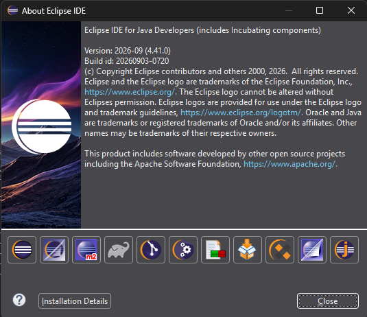
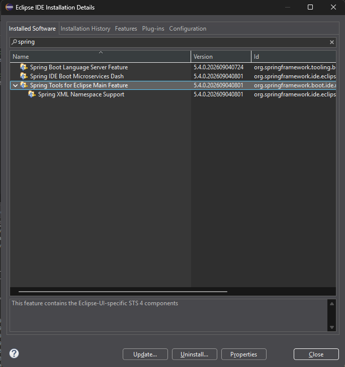
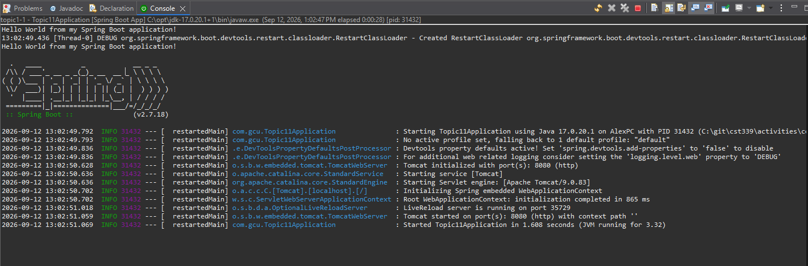
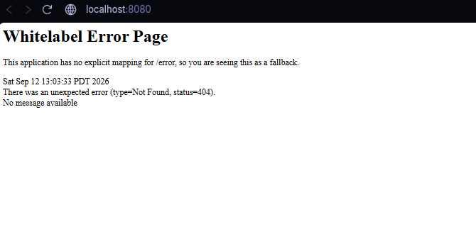
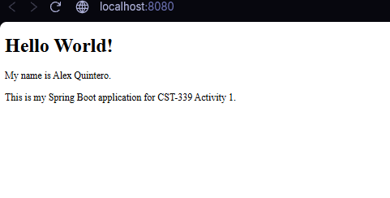
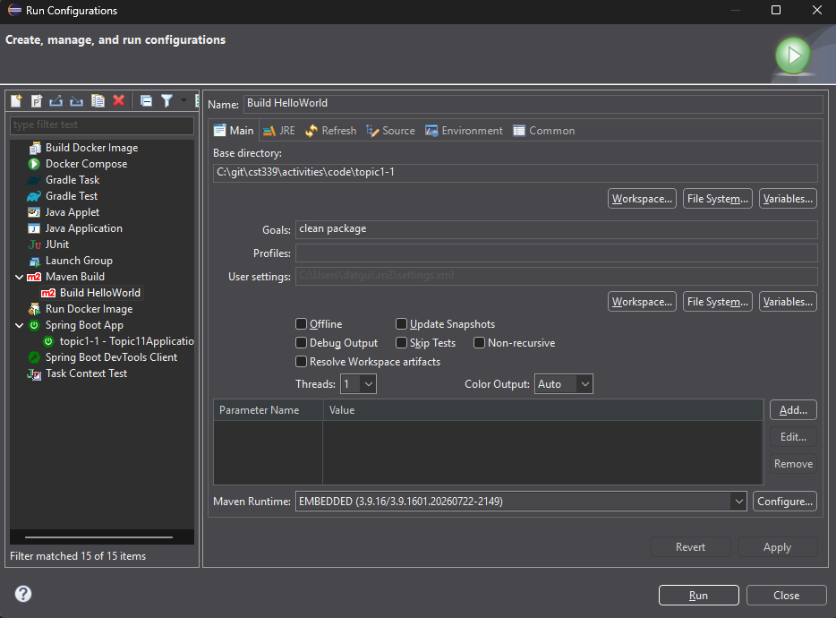
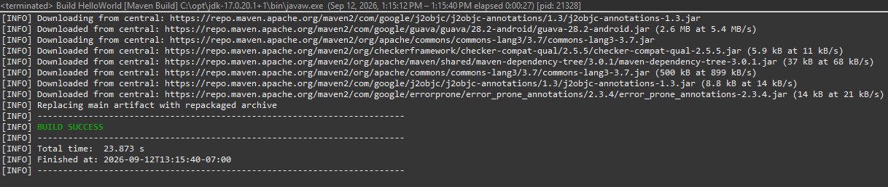
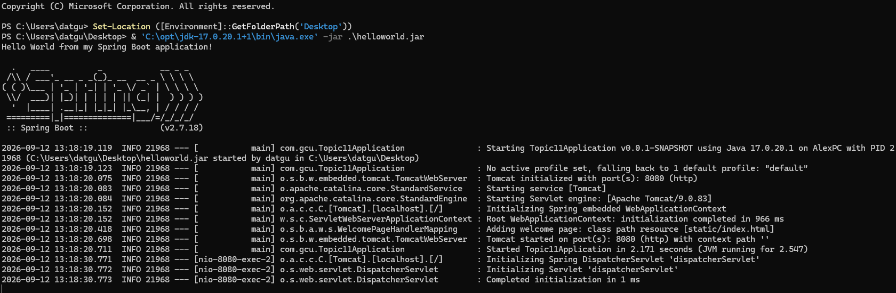
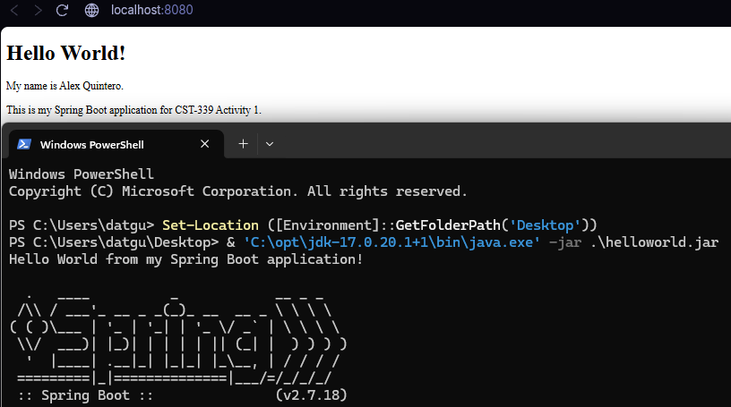

# 🤣 Activity 1: Tools Installation, Validation, and Learning Maven

- Author: Alex Quintero
- Course: CST-339 Programming in Java III
- Instructor: Professor Bobby Estey
- Date: September 12, 2026

## 🐲 Introduction

This activity involved setting up a Java development environment and creating a simple Spring Boot application. The application prints a Hello World message in the console and displays a static HTML page in a browser. Maven was used to build the project and package it as an executable JAR file. The JAR was then run from PowerShell to verify that the application works outside Eclipse.

## Development Environment

| Tool | Purpose |
|---|---|
| Eclipse with Spring Tools | Create, edit, and run the Spring Boot project |
| Java 17 | Compile and run the application |
| Spring Boot 2.7.18 | Configure and start the Spring application |
| Maven | Manage dependencies and package the application |
| Visual Studio Code | Edit the Markdown report |
| Git and GitHub | Track and share the project files |

The project is named `topic1-1`, and its Java package is `com.gcu`. Java 17 and Spring Boot 2.7.18 were selected to follow the main recommendations in the activity guide.

The project includes Spring Web, Spring Boot DevTools, Thymeleaf, and Spring Boot testing dependencies.

## Part 1: Tools Installation and Validation

### Eclipse About Window

The following screenshot shows the installed Eclipse IDE.



### Spring Tools Installation

Spring Tools is installed within Eclipse. The installation details show the Spring Tools for Eclipse feature and its supporting components.



### Application Console Output

The application prints its Hello World message before the Spring Boot banner. The console confirms that the application starts using Java 17 and that the embedded Tomcat server runs on port 8080.

Spring Boot DevTools can cause the greeting to appear twice during the initial launch because it restarts the application through its development class loader.



### Whitelabel Error Page

Before the HTML file was added, visiting `http://localhost:8080` displayed the Whitelabel Error Page with a 404 status. This was the expected result because the application did not yet have a page or controller mapped to the root address.



### Hello World HTML Page

An `index.html` file was created in `src/main/resources/static`. The page includes a document title, a Hello World heading, and two paragraphs identifying the author and assignment.

After restarting the application, the browser displayed the HTML page at `http://localhost:8080`.



## Part 2: Learning Maven

### Project Structure and POM File

Maven organizes the application using a standard project structure.

| File or Folder | Purpose |
|---|---|
| `pom.xml` | Defines project information, dependencies, Java version, and build configuration |
| `src/main/java` | Contains the Java application code |
| `src/main/resources` | Contains application settings and other resources |
| `src/main/resources/static/index.html` | Contains the Hello World web page |
| `src/test/java` | Contains the project’s test code |
| `target` | Contains generated build output |

The `pom.xml` file uses the Spring Boot parent version `2.7.18` and sets `java.version` to `17`. The build configuration sets `finalName` to `helloworld`, producing an executable file named `helloworld.jar`.

### Maven Build Configuration

A Maven run configuration named **Build HelloWorld** was created in Eclipse. Its base directory points to the `topic1-1` project folder containing `pom.xml`. The goals are `clean package`, and the Skip Tests option is unchecked.

The `clean` goal removes previous build output. The `package` phase runs the preceding default lifecycle phases, including compilation and testing, before packaging the application. [Maven build lifecycle documentation](https://maven.apache.org/guides/introduction/introduction-to-the-lifecycle.html)



### Successful Maven Build

The Maven console displays **BUILD SUCCESS**. The Spring Boot Maven plugin repackages the application into an executable JAR.



### Running the JAR from PowerShell

The generated `helloworld.jar` file was copied from the project’s `target` folder to the Desktop. The Eclipse application was stopped before starting the JAR so that port 8080 would be available.

The following commands were used in PowerShell:

```powershell
Set-Location ([Environment]::GetFolderPath('Desktop'))
& 'C:\opt\jdk-17.0.20.1+1\bin\java.exe' -jar .\helloworld.jar
```

The console confirms that the application starts from the Desktop JAR using Java 17. Tomcat starts on port 8080, and Spring Boot recognizes `static/index.html` as the welcome page.



### Browser Validation of the JAR

With the JAR running in PowerShell, the browser displays the Hello World page at `http://localhost:8080`. This verifies that the packaged application serves the page outside Eclipse.



## Research Questions

### 1. Research Spring Boot. Compare building dynamic web applications when using Spring Boot versus just using the Spring framework. How do they differ?

Spring Boot is built on top of the Spring framework, so both approaches can use Spring features to build dynamic web applications. The main difference is how much setup is needed. Using Spring without Boot generally requires more manual choices about dependencies, application configuration, and deployment.

Spring Boot simplifies that setup through starter dependencies, automatic configuration, and embedded servers such as Tomcat. For example, this activity’s application runs from a JAR without requiring a separate Tomcat installation. Developers still write the application’s pages and functionality, but Spring Boot handles much of the supporting setup. Its defaults can also be customized when an application needs different behavior. [Spring Boot documentation](https://docs.spring.io/spring-boot/docs/2.7.18/reference/html/getting-started.html)

### 2. Research Gradle, which is another popular build and dependency management tool. How does it differ from Maven?

Maven and Gradle both manage dependencies and automate work such as compiling code, running tests, and packaging applications. Maven uses an XML file named `pom.xml` to describe the project. Gradle uses build scripts written in Kotlin or Groovy, which allow custom build logic.

Maven organizes builds around a defined lifecycle. For example, running `package` also runs earlier phases such as compilation and testing. Gradle organizes work into tasks and determines their order from task dependencies. Gradle also supports incremental builds and build caching, which can reduce repeated work. Both tools support conventions and customization, but Maven emphasizes a standardized lifecycle while Gradle provides a programmable task model. [Maven build lifecycle documentation](https://maven.apache.org/guides/introduction/introduction-to-the-lifecycle.html), [Gradle comparison with Maven](https://docs.gradle.org/current/userguide/migrating_from_maven.html)

## Conclusion

The application successfully ran in Eclipse, displayed the Hello World page, and built through Maven. Running the packaged JAR from PowerShell also displayed the same page in the browser. These results verified the local development environment and demonstrated how Maven packages a Spring Boot application for execution outside the IDE.

The activity also showed the different roles of Java code, static HTML, application settings, and the Maven POM file. The initial Whitelabel page was replaced by the completed HTML page, and the final application startup showed no runtime warnings or errors.

## Project Links

- [Activity 1 source code](../code/topic1-1/)
- [GitHub repository](https://github.com/AQuintero96/cst339)

## References

- Spring. [Spring Boot 2.7.18: Getting Started](https://docs.spring.io/spring-boot/docs/2.7.18/reference/html/getting-started.html).
- Apache Software Foundation. [Introduction to the Build Lifecycle](https://maven.apache.org/guides/introduction/introduction-to-the-lifecycle.html).
- Gradle. [Migrating Builds From Apache Maven](https://docs.gradle.org/current/userguide/migrating_from_maven.html).