# Activity 2: Spring MVC

- **Author:** Alex Quintero
- **Course:** CST-339 Programming in Java III
- **Instructor:** Professor Bobby Estey
- **Date:** September 19, 2026

## Introduction

This activity explored how Spring MVC handles browser requests, passes data to views, and processes forms. Two Spring Boot applications were developed: `topic2-1` for controller and view examples, and `topic2-2` for form submission, validation, and reusable page layouts.

The activity included plain-text responses, Thymeleaf templates, model attributes, request parameters, an orders table, and shared page fragments. Both applications were built with Maven and run as executable JAR files from PowerShell.

## Development Environment

| Tool or Technology | Purpose |
|---|---|
| Java 17 | Compile and run the applications |
| Spring Boot 2.7.18 | Configure and launch the applications |
| Spring MVC | Handle requests and connect controllers with views |
| Thymeleaf | Render HTML pages using model data |
| Thymeleaf Layout Dialect | Share a common layout between pages |
| Bean Validation | Check submitted form values |
| Bootstrap | Style the navigation, forms, and tables |
| Eclipse with Spring Tools | Develop and run the applications |
| Maven | Manage dependencies, run tests, and package executable JAR files |
| PowerShell | Run the packaged applications outside Eclipse |
| GitHub and Markdown | Track the source code and document the results |

## Project Organization

| Project | Activity Content | Source Code |
|---|---|---|
| `topic2-1` | Part 1: Controllers and Views | [View source](../code/topic2-1/) |
| `topic2-2` | Part 2: Forms and Validation; Part 3: Shared Layouts | [View source](../code/topic2-2/) |

Part 3 extends the forms and validation application created in Part 2.

## Part 1: Controllers and Views

### Test 1: Plain-Text Response

The `/hello/test1` endpoint returns `Hello World!` directly to the browser. The controller uses `@ResponseBody`, so the returned text becomes the response body instead of a template name.

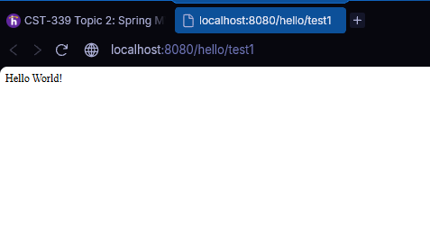

### Test 2: Model Attributes

The `/hello/test2` endpoint adds a message to the Spring MVC `Model`. The Thymeleaf template reads that attribute and displays `Hello Spring MVC Framework!`.

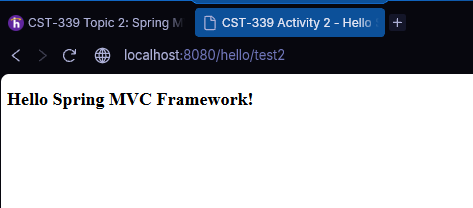

### Test 3: ModelAndView

The `/hello/test3` endpoint uses `ModelAndView` to return the view name and its data together. Both messages appear on the rendered page.

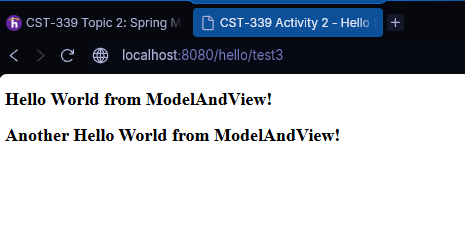

### Test 4: Request Parameter

The `/hello/test4` example accepts a message through a request parameter and passes it to the template. This allows the displayed message to come from the request.

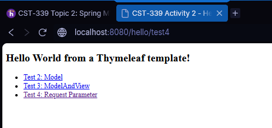

### Navigation Links

The Hello page includes links to the Model, ModelAndView, and request parameter examples. These links allow navigation between the examples without manually entering each address.

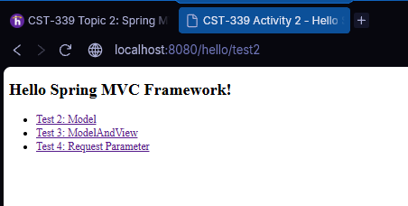

### Home Page

The root address displays a welcome page with a link to the Spring MVC examples.

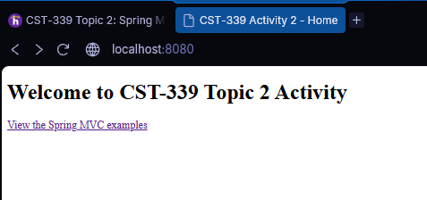

### Maven Build

Maven completed the build successfully, with one test run and no failures or errors. The application was packaged as `cst339activity.jar`.

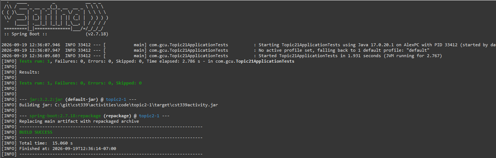

### Executable JAR Startup

The packaged application was started from PowerShell using Java 17. The console shows the embedded Tomcat server starting on port 8080.

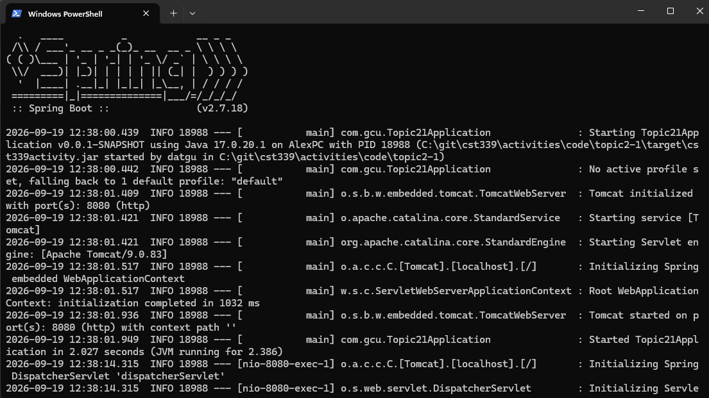

### Browser Verification from the JAR

The home page remained accessible when the application was running from its JAR outside Eclipse.

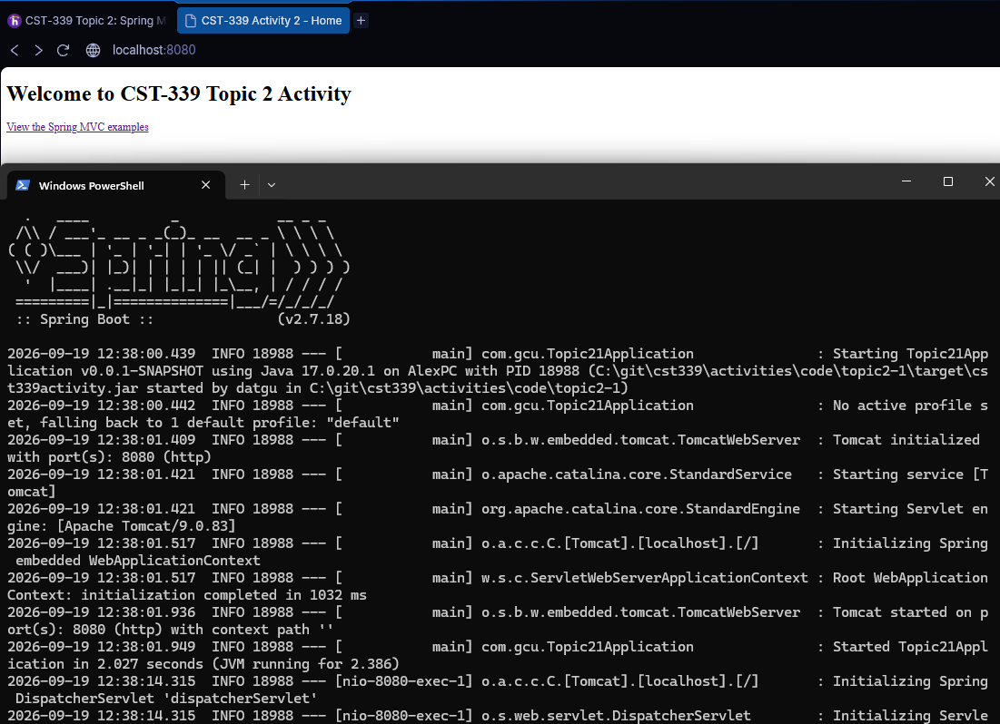

## Part 2: Forms and Validation

### Login Form Before Validation

The login page contains user name and password fields. Thymeleaf binds these fields to the properties in `LoginModel`, and the form submits to `/login/doLogin`.

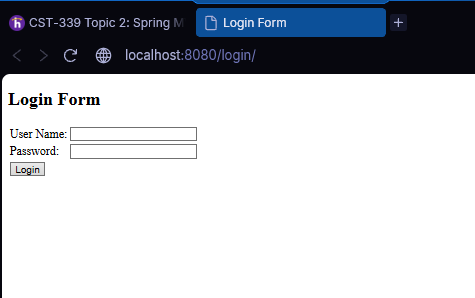

### Submitted Form Values

Dummy values were submitted to confirm that the controller received the form data. The console output shows the values used for this demonstration. Password logging was removed from the later controller version.

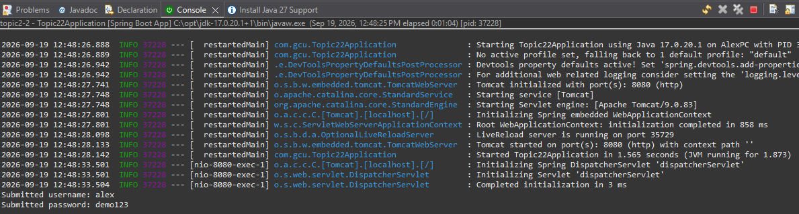

### Orders Page Before the Shared Layout

The controller creates a sample list of `OrderModel` objects and passes it to the orders view. Thymeleaf generates one table row for each order and displays its order number, product name, price, and quantity.

These records are sample data created in memory; they are not retrieved from a database.

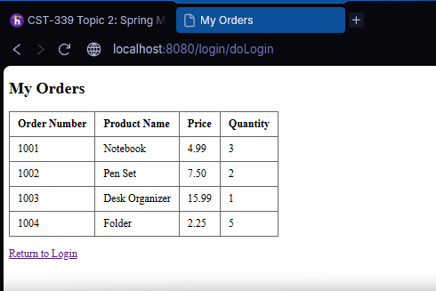

### Form Validation

The user name and password properties use `@NotNull` and `@Size` validation annotations. Both fields must contain between 1 and 32 characters.

The controller uses `@Valid` and checks `BindingResult` before displaying the orders page. When validation fails, the login form is returned with messages beside the fields and an error summary below the form.

Submitting both fields empty produced the messages shown below. Submitting valid-length demonstration values returned the orders page.

This example validates input; it does not authenticate users against stored accounts.

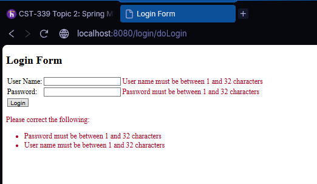

## Part 3: Shared Thymeleaf Layouts

### Common Layout

The login and orders pages use `defaultTemplate.html` as their shared layout. The `common.html` file defines reusable header and footer fragments.

The shared layout provides:

- The application heading.
- A navigation link to the login page.
- A page title supplied by the controller.
- The GCU logo.
- A content area for each page.
- The footer text specified in the activity guide.

Bootstrap provides the page styling. The logo is stored as `gcu-logo.png`, and the template references that filename.

### Login Page with the Shared Layout

The login form appears within the common layout. The top **Login Page** link navigates to the form, while the **Login** button submits the entered values.

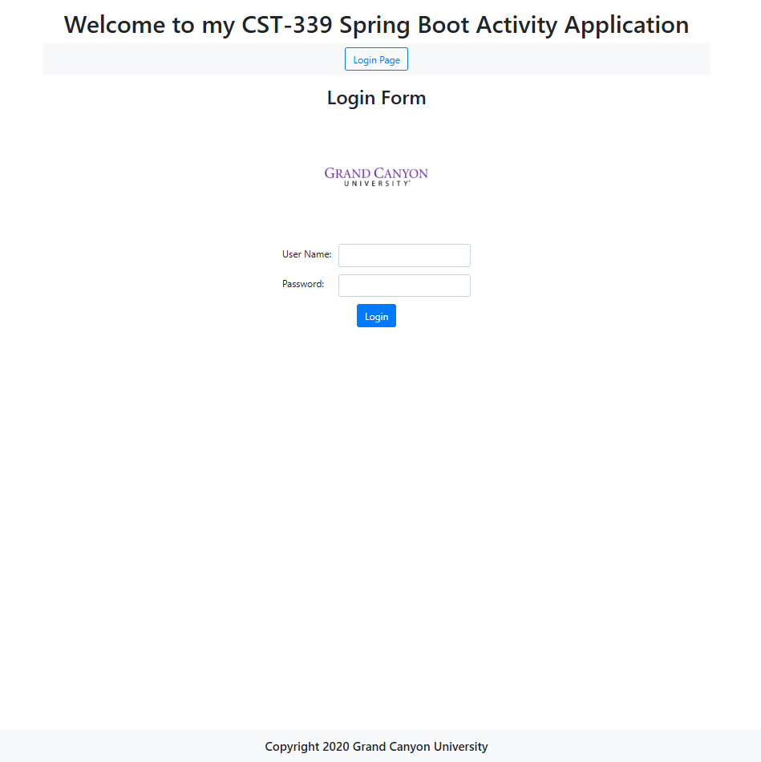

### Orders Page with the Shared Layout

The orders page uses the same header, logo, navigation, and footer. Only the page title and main content change.

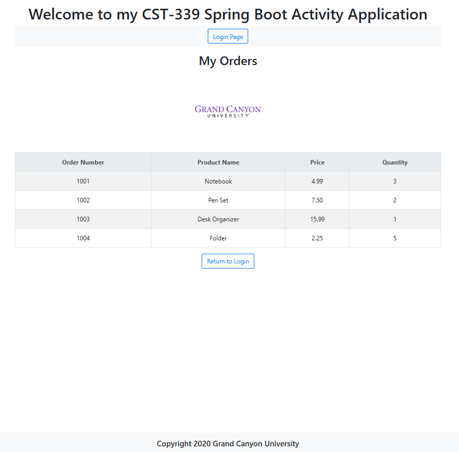

### Final Maven Build

The completed `topic2-2` application built successfully. Maven reported one test run, zero failures, and zero errors, and created the executable `cst339activity.jar`.

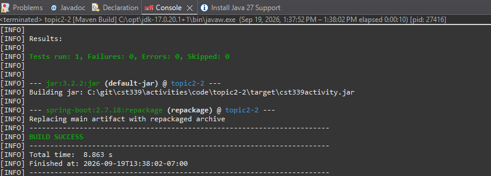

### Final Executable JAR Startup

The packaged application was launched from PowerShell. The console shows `Topic22Application` starting successfully and Tomcat listening on port 8080.

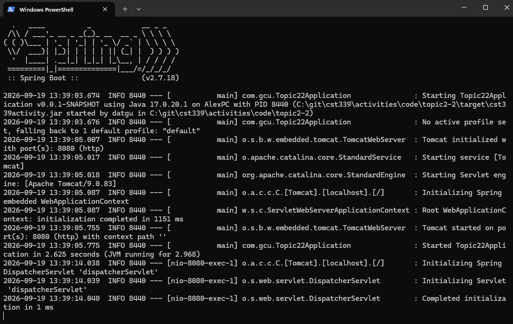

### Orders Page from the Executable JAR

Submitting valid-length demonstration values displayed the orders page while the application was running outside Eclipse. The shared layout, logo, and sample records rendered successfully.

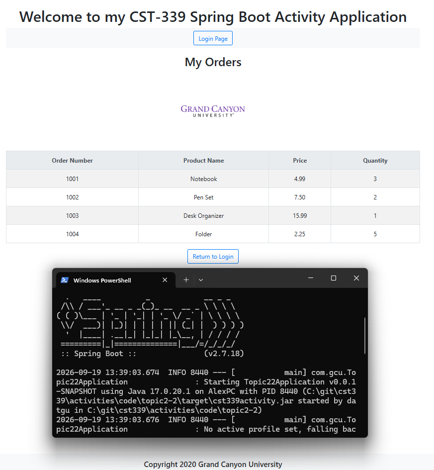

## Research Questions

### 1. How does Spring MVC support the MVC design pattern?

Spring MVC separates request handling, application data, and page presentation. Its `DispatcherServlet` acts as a front controller, coordinating request handling and view rendering through supporting components. [Spring Framework: DispatcherServlet](https://docs.spring.io/spring-framework/reference/web/webmvc/mvc-servlet.html)

The three MVC responsibilities can be seen in this activity:

| Component | Responsibility | Activity Example |
|---|---|---|
| Model | Holds data used by the application and supplied to the view | `LoginModel`, `OrderModel`, and the attributes added to Spring's `Model` |
| View | Presents data to the user | Thymeleaf templates such as `login.html` and `orders.html` |
| Controller | Handles requests and selects the next view with its data | `HelloWorldController`, `HomeController`, and `LoginController` |

For a rendered page, a controller supplies model attributes and returns a view name. Thymeleaf uses those attributes to generate the HTML response. This keeps presentation markup separate from request-handling code. [Spring Guide: Serving Web Content with Spring MVC](https://spring.io/guides/gs/serving-web-content)

The following diagram shows the login submission flow implemented in this activity:

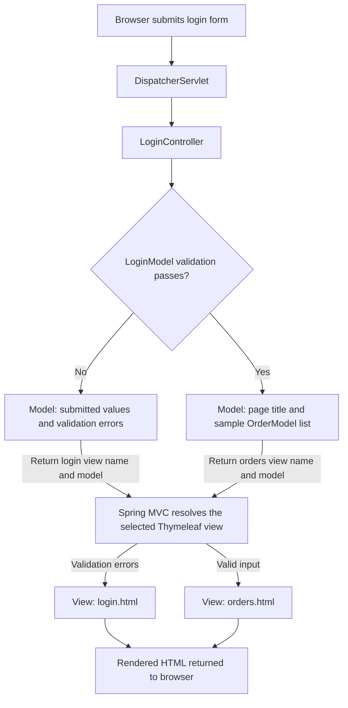

The plain-text `/hello/test1` endpoint demonstrates another response type: `@ResponseBody` returns content directly instead of rendering a view.

### 2. What are two other MVC frameworks, and how do they differ from Spring MVC?

#### Ruby on Rails

Ruby on Rails is a Ruby web framework that follows MVC. It emphasizes convention over configuration, providing standard naming and project organization patterns to reduce repetitive setup.

Unlike the Java-based Spring MVC application in this activity, Rails applications use Ruby. Rails also provides an integrated approach to models, database access, controllers, and views. Spring MVC handles the web layer within the broader Spring ecosystem. [Ruby on Rails: Getting Started](https://guides.rubyonrails.org/getting_started.html)

#### Django

Django is a Python web framework with a related separation of responsibilities called Model-Template-View, or MTV.

Its terminology differs from Spring MVC: a Django template handles presentation, while a Django view determines the data returned for a request. Django's framework and URL routing perform much of the coordinating role associated with a controller. Spring MVC uses explicitly named controller classes and view templates. [Django: MVC and MTV Explanation](https://docs.djangoproject.com/en/dev/faq/general/)

| Framework | Language Used Here or Typically | Organization |
|---|---|---|
| Spring MVC | Java | Models, controllers, and views such as Thymeleaf templates |
| Ruby on Rails | Ruby | MVC with strong naming and configuration conventions |
| Django | Python | Model-Template-View terminology with framework-managed routing |

## Conclusion

This activity demonstrated the request-to-response flow of a Spring MVC application. Controller methods returned plain text, supplied model attributes, accepted request parameters, and processed submitted form values.

The login example showed how validation prevents invalid input from continuing to the orders page. The shared Thymeleaf layout reduced repeated HTML by placing common page elements in reusable fragments.

Both projects built successfully with Maven and ran as executable JAR files outside Eclipse. These examples established a foundation for developing web interfaces with separate responsibilities for data, request handling, and presentation.

## References

- CST-339 Activity 2 Guide, supplied as `CST-339-Activity 2 Guide.pdf`.
- [Professor's Activity 2 Instructions](https://gitlab.com/bobby.estey/gcu-cst339/-/blob/main/activities/activity02.md).
- [Spring Framework: DispatcherServlet](https://docs.spring.io/spring-framework/reference/web/webmvc/mvc-servlet.html).
- [Spring Guide: Serving Web Content with Spring MVC](https://spring.io/guides/gs/serving-web-content).
- [Ruby on Rails: Getting Started](https://guides.rubyonrails.org/getting_started.html).
- [Django: General FAQ - MVC and MTV](https://docs.djangoproject.com/en/dev/faq/general/).