# Activity 3: Spring Bean Services Using Spring Core

- **Author:** Alex Quintero
- **Instructor:** Professor Bobby Estey
- **Course:** CST-339 Programming in Java III
- **Date:** September 26, 2026
- **REST API documentation:** [Orders REST API Design](rest-api-design.md)

## Introduction

Activity 3 builds on the login and orders application from Activity 2. The main changes move the order data into a business service, use Spring to supply service dependencies, and expose the orders through JSON and XML endpoints.

The activity also compares bean scopes. Console messages show when Spring creates service instances, when those instances are reused, and when cleanup methods run.

## Development Environment

| Tool or Technology | Purpose |
| --- | --- |
| Java 17 | Compile and run the applications |
| Spring Boot 2.7.18 | Configure and start the applications |
| Spring Core | Manage beans, dependency injection, and bean scopes |
| Spring MVC | Handle form submissions and REST requests |
| Thymeleaf | Display the existing login and orders pages |
| JAXB | Convert the order list into XML |
| Maven | Manage project dependencies |
| Eclipse with Spring Tools | Edit and run the projects |
| Postman | Send requests and inspect API responses |
| GitHub and Markdown | Store the code and document the activity |

## Project Organization

| Project | Work Completed | Source |
| --- | --- | --- |
| `topic3-1` | Business services, dependency injection, and moving orders out of the controller | [View source](../code/topic3-1/) |
| `topic3-2` | Bean lifecycle, scope comparisons, and JSON and XML REST endpoints | [View source](../code/topic3-2/) |

The `topic3-1` project was copied from Activity 2's `topic2-2`. After Part 1, it was copied to `topic3-2` for the remaining work.

The final configuration in `topic3-2` uses singleton scope. The screenshots below preserve the results from the other scope configurations.

## Part 1: Creating Spring Bean Services

### Orders Business Service

An interface named `OrdersBusinessServiceInterface` defines the operations available to the controller. `OrdersBusinessService` implements that interface.

The `SpringConfig` class registers the implementation using `@Bean`. The login controller receives the service through `@Autowired` and calls its `test()` method after valid form input.

The console message confirms that the service method was called.

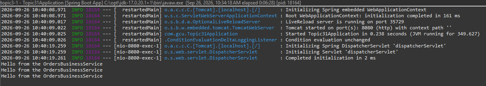

### Alternative Service Implementation

`AnotherOrdersBusinessService` implements the same interface. Changing the object returned by `SpringConfig` switches the implementation used by the controller.

The controller did not need to change because it depends on the interface. The different console message confirms that Spring supplied the alternative implementation.

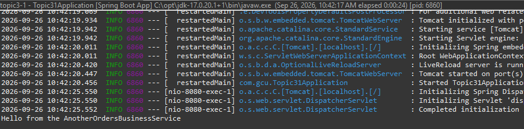

After this check, the configuration was changed back to `OrdersBusinessService`.

### Security Business Service

`SecurityBusinessService` uses `@Service`, allowing Spring to discover it through component scanning. The controller receives it through dependency injection and calls `authenticate()`.

For this exercise, the method prints a message and always returns `true`. It demonstrates calling a service, not actual account authentication.

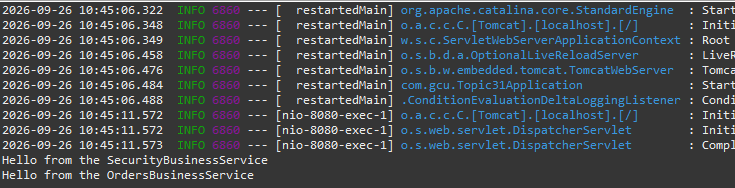

### Orders Returned by the Business Service

The `getOrders()` method was added to the interface and both implementations. The hard-coded order list was moved out of the login controller.

The controller now calls `service.getOrders()` and passes the returned list to the view. The page still shows the same four orders, but the service now supplies the data.

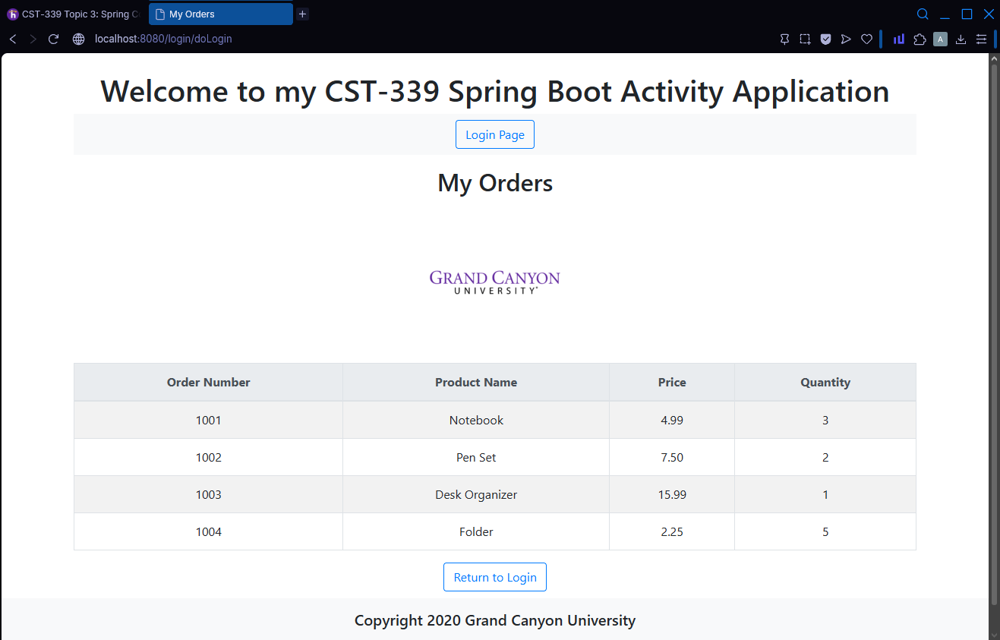

## Part 2: Spring Bean Lifecycle and Scopes

The service interface and both implementations were updated with `init()` and `destroy()` methods. These methods print messages so the lifecycle behavior can be observed.

The bean definition identifies the callbacks using:

```java
@Bean(
    name = "ordersBusinessService",
    initMethod = "init",
    destroyMethod = "destroy"
)
```

Each scope was tested separately after restarting the application. Files were left unchanged during the tests to avoid extra lifecycle messages from development restarts.

### Initial Singleton Lifecycle

Spring called `init()` once when it created the orders bean during startup. The same instance handled the login submission, and `destroy()` ran when the application shut down.

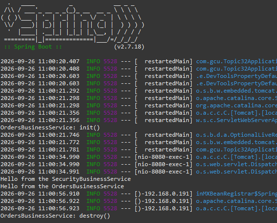

### Prototype Scope

Three valid submissions produced six `init()` calls because each submission called `test()` and `getOrders()` through the prototype proxy, creating a new instance for each method call. Spring does not automatically call `destroy()` for prototype instances.

The configuration used:

```java
@Scope(
    value = "prototype",
    proxyMode = ScopedProxyMode.INTERFACES
)
```

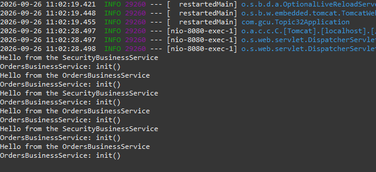

### Request Scope

Three valid submissions produced three `init()` calls and three `destroy()` calls. Each submission used one instance for both service methods, and Spring destroyed that instance when the request ended. Opening the login form alone did not create an instance because its GET handler did not call the orders service.

The configuration used:

```java
@RequestScope(proxyMode = ScopedProxyMode.INTERFACES)
```

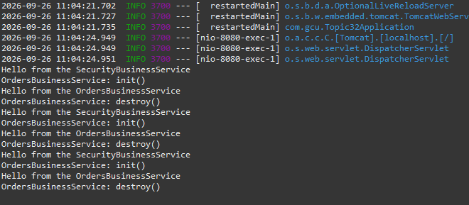

### Session Scope

Three submissions in the first browser produced one `init()` call. The second browser session produced one additional `init()` call, and its later submission reused that instance. Each browser session kept its own orders service instance.

The configuration used:

```java
@SessionScope(proxyMode = ScopedProxyMode.INTERFACES)
```

Opera GX was used for the first session.

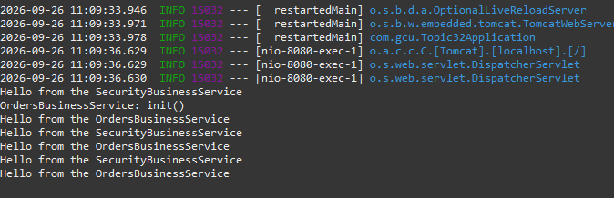

Microsoft Edge was used for the second session while the first browser remained open.

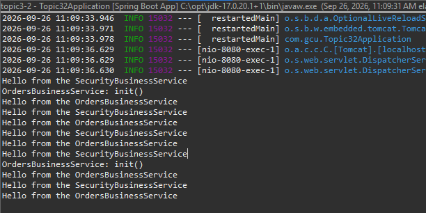

### Singleton Scope

Spring called `init()` once during startup, and all five submissions across both browsers used that same instance. Singleton scope shares one bean instance per bean definition within the application context.

Removing the scope annotation restored the default singleton behavior.

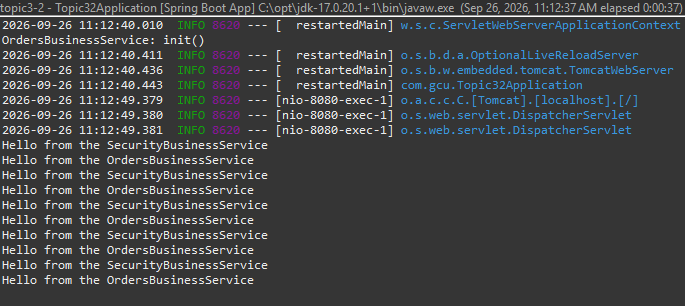

### Scope Comparison

| Scope | Test | Observed Initialization Calls | Instance Reuse |
| --- | --- | :---: | --- |
| Prototype with a scoped proxy | Three valid submissions | 6 | A new instance for each service method call |
| Request | Three valid submissions | 3 | Both service calls share one instance during the request |
| Session | Three submissions in one browser and two in another | 2 | One instance per browser session |
| Singleton | Five submissions across two browsers | 1 | One instance shared across both sessions |

These counts depend on how the controller uses the service. In this application, each valid submission calls both `test()` and `getOrders()`.

The prototype result is specific to the scoped proxy configuration. A prototype bean injected directly into a singleton without a proxy would not automatically become a new instance on every method call. [Spring documentation: Bean Scopes](https://docs.spring.io/spring-framework/reference/core/beans/factory-scopes.html)

## Part 3: Creating REST Services

### REST Controller

`OrdersRestService` provides two GET endpoints under `/service`. Both use the existing orders business service.

| Method | Endpoint | Response |
| --- | --- | --- |
| GET | `/service/getjson` | JSON array containing the orders |
| GET | `/service/getxml` | XML document containing the orders |

The JSON method returns `List<OrderModel>` directly. The XML method returns an `OrderList`, which provides the `orders` root element and an `order` element for each item.

An empty constructor was added to `OrderModel` for XML binding. The POM was also updated with the XML binding API and runtime implementation.

Neither endpoint requires login, request parameters, or a request body.

### JSON in the Browser

The JSON endpoint returns all four orders. The browser's Pretty-print option makes the fields and records easier to read.

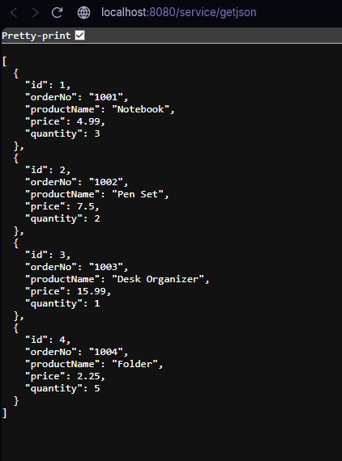

### XML in the Browser

The XML endpoint returns the same orders inside an `orders` root element.

The browser's message about missing style information is normal for an XML document without a stylesheet.

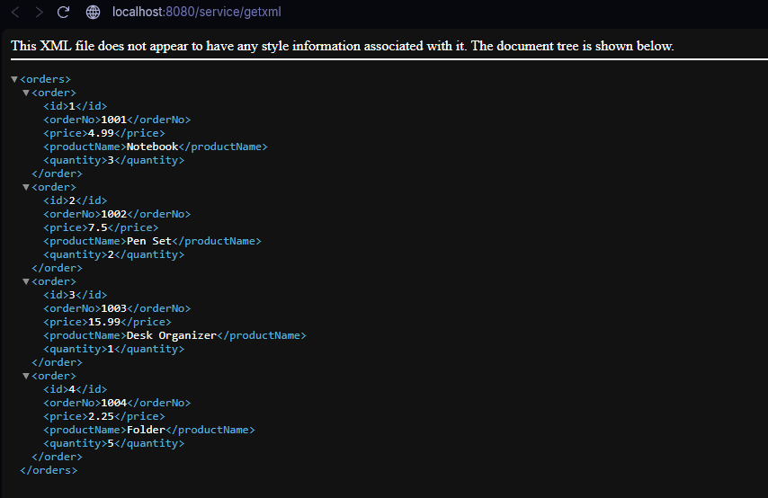

### JSON in Postman

A collection named `CST-339 Activity 3` was created in Postman. The `Get Orders JSON` request sends a GET request to:

```text
http://localhost:8080/service/getjson
```

Postman returned `200 OK` and displayed the JSON response.

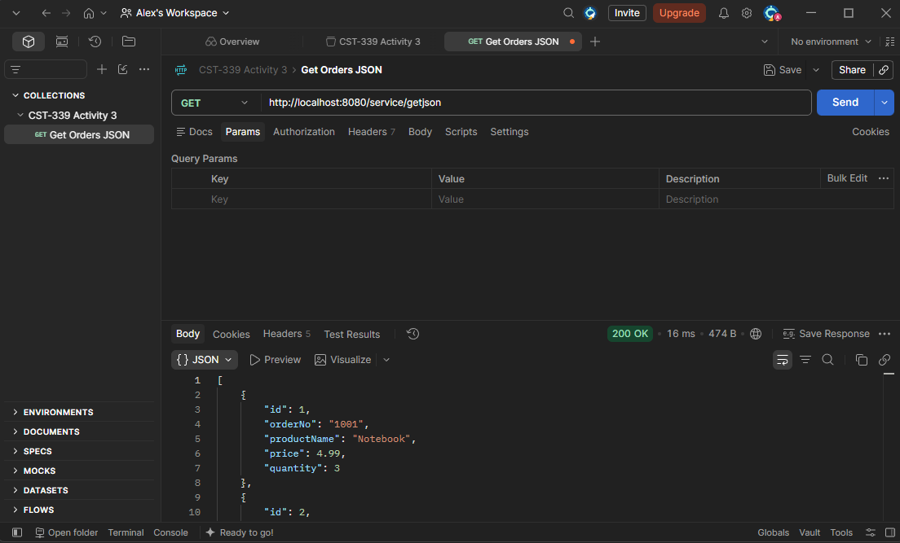

### XML in Postman

The `Get Orders XML` request sends a GET request to:

```text
http://localhost:8080/service/getxml
```

Postman returned `200 OK` and displayed the XML response.

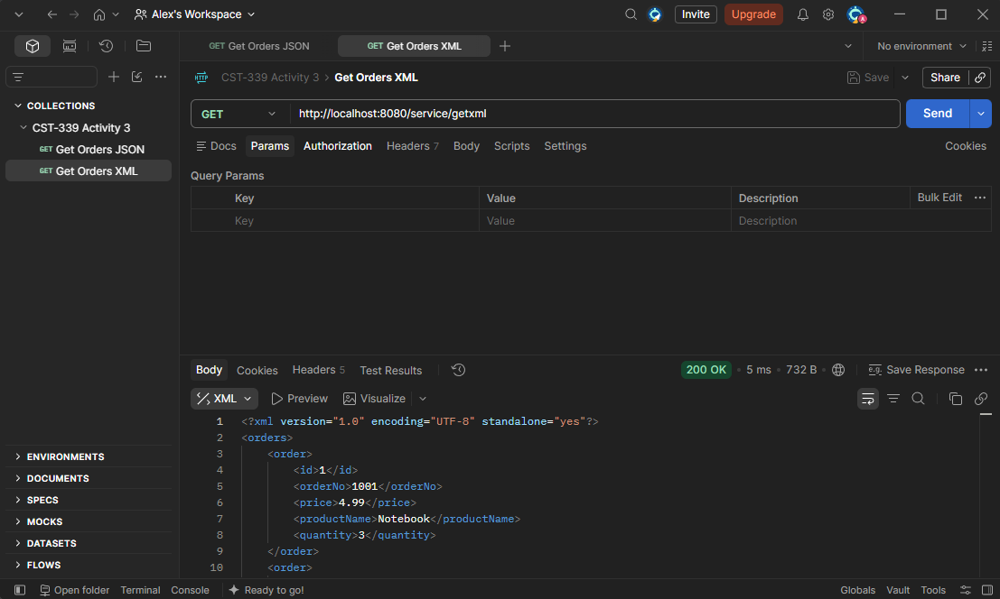

These were manual request-and-response checks. Automated Postman assertions were not added.

### REST API Design Document

[View the Orders REST API Design](rest-api-design.md)

The design document includes the endpoint addresses, request requirements, successful response examples, field descriptions, and testing results. It follows the request-and-response structure of the supplied API design template.

## Research Questions

### 1. What is the difference between @Component, @Service, and @Bean? When would you use one instead of another?

All three can be used to register objects that Spring manages, but they serve different purposes.

| Annotation | Where It Is Used | When to Use It |
| --- | --- | --- |
| `@Component` | On a class | For a general Spring-managed component discovered through scanning |
| `@Service` | On a class | For a business service, making the class's role clear |
| `@Bean` | On a method, usually in a configuration class | When explicitly creating and configuring the object that Spring should manage |

`@Service` is a specialized form of `@Component`. Both can be discovered through component scanning, but `@Service` communicates that the class belongs to the business-service layer. [Spring documentation: Classpath Scanning](https://docs.spring.io/spring/reference/6.2/core/beans/classpath-scanning.html)

`@Bean` gives control over how an object is created. It is useful when selecting an implementation, supplying custom configuration, or registering a class from a library that cannot be edited. [Spring documentation: Using @Bean](https://docs.spring.io/spring-framework/reference/core/beans/java/bean-annotation.html)

This activity used `@Service` for `SecurityBusinessService`. The orders service used `@Bean`, which made it possible to switch between two implementations by changing `SpringConfig`.

### 2. Why does an Inversion of Control container encourage designing and coding to interface contracts?

An IoC container creates and supplies dependencies instead of making each class construct them itself. Using an interface lets the receiving class describe the operations it needs without depending on one implementation.

Spring does not strictly require interfaces. It can also inject concrete classes, as shown by `SecurityBusinessService` in this activity. Interfaces are a design choice that makes implementations easier to replace and test. [Spring Boot documentation: Beans and Dependency Injection](https://docs.spring.io/spring-boot/reference/using/spring-beans-and-dependency-injection.html)

The orders service demonstrated this directly. `LoginController` depended on `OrdersBusinessServiceInterface`, so changing from `OrdersBusinessService` to `AnotherOrdersBusinessService` did not require rewriting the controller.

The interface acts as an agreement: either implementation must provide the methods the controller expects. This reduces how much the controller needs to know about the service's internal code.

## Conclusion

Activity 3 showed how Spring manages service objects and supplies them to other classes. Switching implementations through configuration demonstrated the value of depending on an interface, while moving the orders list into a service reduced the controller's responsibilities.

The scope tests made the lifecycle differences visible in the console. Prototype, request, session, and singleton configurations produced different initialization counts because each one controls how service instances are created and reused.

The final REST endpoints reused the same business service to return JSON and XML. Both formats were checked in the browser and returned successful responses in Postman.

## References

- CST-339 Activity 3 Guide, supplied as `CST-339-RS-Activity3Guide.pdf`.
- CST-339 REST API Design Template 1, supplied as `CST-339-RS-REST_API_DesignTemplate1.docx`.
- [Spring documentation: Bean Scopes](https://docs.spring.io/spring-framework/reference/core/beans/factory-scopes.html).
- [Spring documentation: Classpath Scanning and Managed Components](https://docs.spring.io/spring/reference/6.2/core/beans/classpath-scanning.html).
- [Spring documentation: Using the @Bean Annotation](https://docs.spring.io/spring-framework/reference/core/beans/java/bean-annotation.html).
- [Spring Boot documentation: Spring Beans and Dependency Injection](https://docs.spring.io/spring-boot/reference/using/spring-beans-and-dependency-injection.html).