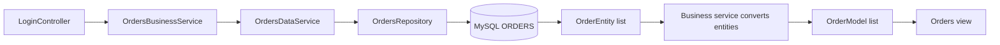
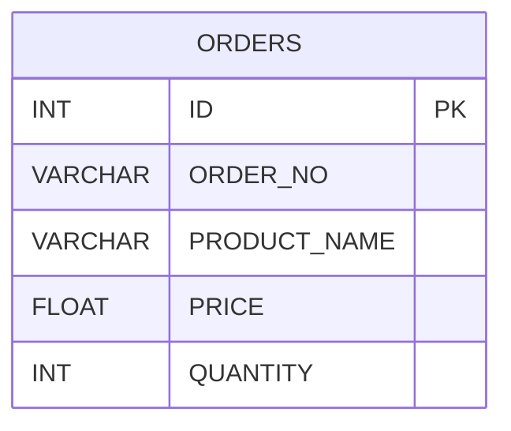

# Activity 4: Design and Setup

[Activity Overview](README.md) | [Analysis and Planning](analysisPlanning.md) | [Testing](test.md)

## Development Environment

- Java 17
- Spring Boot 2.7.18
- Eclipse with Spring Tools
- Maven Wrapper
- MySQL and MySQL Workbench
- Local database connection at 127.0.0.1:3306

## Project Structure

| Project | Data access approach |
| --- | --- |
| topic4-1 | JdbcTemplate reads rows directly into OrderModel objects |
| topic4-2 | CrudRepository retrieves OrderEntity objects |
| topic4-3 | Repository uses a custom SELECT query; JdbcTemplate handles inserts |

The projects share the login form, orders view, and business service interface from Activity 3.

## Request Flow

### Part 1


### Parts 2 and 3



Part 2 uses the repository's generated read operation. Part 3 supplies the SELECT statement through `@Query`.

## Main Classes

| Class or interface | Responsibility |
| --- | --- |
| LoginController | Validates login input and supplies orders to the view |
| OrdersBusinessServiceInterface | Defines the business service operations |
| OrdersBusinessService | Retrieves orders and, in Parts 2 and 3, converts entities to presentation models |
| DataAccessInterface | Defines generic data access operations |
| OrdersDataService | Implements the activity's read and create operations |
| OrderModel | Holds order information used by the controller and views |
| OrderEntity | Maps Java fields to database columns in Parts 2 and 3 |
| OrdersRepository | Provides repository operations in Parts 2 and 3 |
| OrderRowMapper | Maps a JDBC result row to an entity; included as directed by the guide |
| SpringConfig | Creates the business service bean and configures its lifecycle callbacks |

## Database Design

The supplied SQL script creates the `cst339` database and its `ORDERS` table. The table contains 11 sample records.



| Column | Definition |
| --- | --- |
| ID | Auto-increment integer primary key |
| ORDER_NO | Required text, up to 25 characters |
| PRODUCT_NAME | Required text, up to 128 characters |
| PRICE | Required floating-point value |
| QUANTITY | Required integer |

The application retains the supplied FLOAT price column and Java float field for this exercise.

## Database Setup

1. Start the local MySQL server.
2. Connect through MySQL Workbench.
3. Open the supplied Activity 4 MySQL script.
4. Check for existing data before executing it. The script drops and recreates ORDERS.
5. Execute the script and refresh the schema list.
6. Query ORDERS and confirm that it contains 11 records.

The application uses the dedicated `cst339_app` account with SELECT, INSERT, UPDATE, and DELETE privileges on `cst339`.

## Application Configuration

Each project's `application.properties` contains its own application name and the shared connection settings. For Part 3:

```properties
spring.application.name=topic4-3
spring.datasource.url=jdbc:mysql://127.0.0.1:3306/cst339
spring.datasource.username=cst339_app
spring.datasource.password=${DB_PASSWORD:}
```

The password comes from the launch environment. The empty fallback does not make the database account passwordless; the configured account still requires its password.

Part 1 uses `spring-boot-starter-jdbc`. Parts 2 and 3 use `spring-boot-starter-data-jdbc`. All three use the MySQL Connector/J driver.

## Running in Eclipse

1. Import the desired project as an existing Maven project.
2. Select Java 17 and run Maven Update Project.
3. Open its Spring Boot run configuration.
4. Add `DB_PASSWORD` under Environment using the activity account's password.
5. Keep MySQL running and stop any other application using port 8080.
6. Run the project.
7. Open `http://localhost:8080/login/` and submit valid form values.

The login is the simulated login carried forward from Activity 3. Database credentials are configured separately.

## Building and Running the JAR

The final project's POM sets the output name to `cst339activity`.

On the development computer, run these commands in PowerShell:

```powershell
Set-Location 'C:\git\cst339\activities\code\topic4-3'

$env:JAVA_HOME = 'C:\opt\jdk-17.0.20.1+1'
$env:Path = "$env:JAVA_HOME\bin;$env:Path"

$dbCredential = Get-Credential -UserName 'cst339_app' -Message 'Enter your activity database password'
$env:DB_PASSWORD = $dbCredential.GetNetworkCredential().Password

.\mvnw.cmd clean package
java -jar target\cst339activity.jar
```

Use the appropriate project and JDK paths on another computer. Eclipse's launch environment does not automatically carry over to PowerShell.

After startup, open the login page and submit the form. The packaged application should display the same 11 database orders.

Press Ctrl+C in PowerShell to stop it.

## Implementation Boundaries

The login demonstration exercises findAll. It does not call create, update, delete, or findById.

The update and delete methods retain the guide's placeholder `true` returns, and findById returns null. They must be implemented before being used as real database operations.

[Return to Activity 4](README.md)