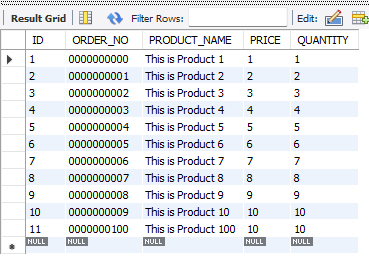
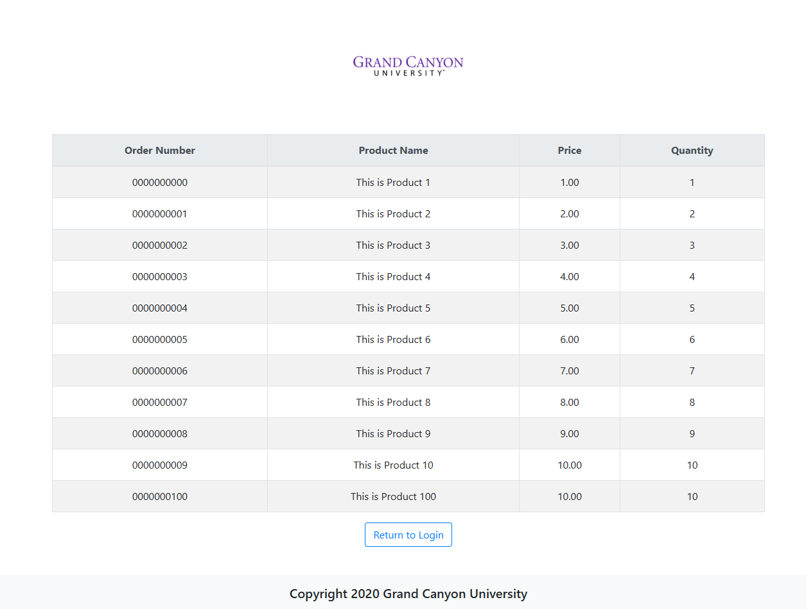
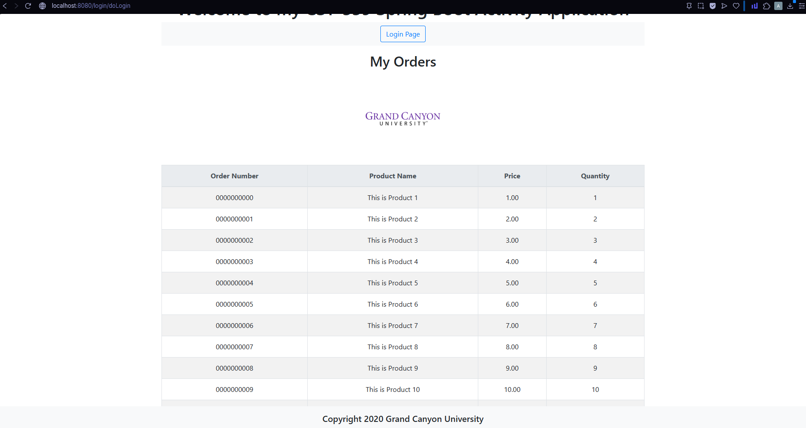
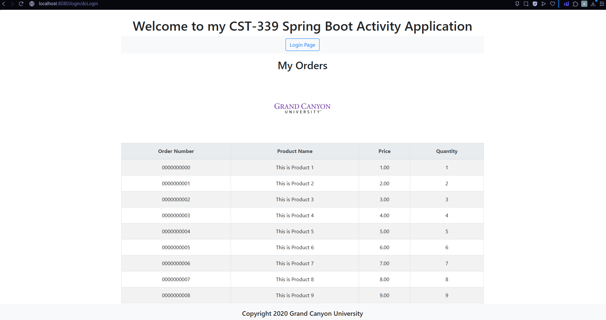
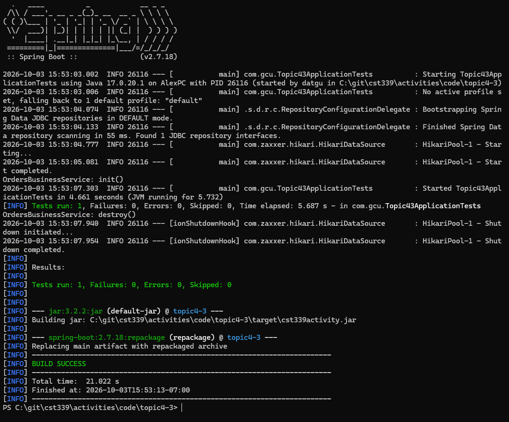
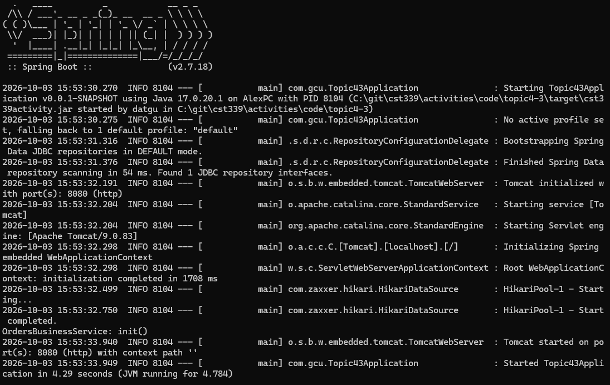
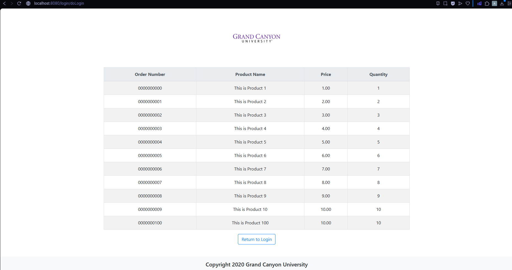

# Activity 4: Testing and Screenshots

[Activity Overview](README.md) | [Analysis and Planning](analysisPlanning.md) | [Design and Setup](design.md)

## Test Results

| Check | Result |
| --- | --- |
| Import the supplied database script | ORDERS contained 11 sample records |
| Part 1: Spring JDBC | Database orders displayed through JdbcTemplate |
| Part 2: Spring Data JDBC | Database orders displayed through CrudRepository |
| Part 3: Custom SQL | Database orders displayed through the custom repository query |
| Maven package build | BUILD SUCCESS using Java 17.0.20.1 |
| Application test | 1 test, 0 failures, 0 errors, 0 skipped |
| Executable JAR startup | Application started on port 8080 |
| Executable JAR orders page | All 11 database orders displayed |

The browser checks exercised the read operation. The create methods were implemented but were not tested by this workflow. The optional find-by-ID, update, and delete operations remain placeholders.

## Screenshot Evidence

Click a thumbnail to open the full image.

| Test | Description | Screenshot |
| --- | --- | --- |
| 1. Database import | MySQL Workbench displays the 11 records supplied by the activity script. |  |
| 2. Spring JDBC | Part 1 displays database orders using JdbcTemplate and SqlRowSet. |  |
| 3. Spring Data JDBC | Part 2 displays orders retrieved through the repository and converted from entities to presentation models. |  |
| 4. Custom query | Part 3 displays orders retrieved by the repository's explicit SELECT statement. |  |
| 5. Maven build | The Java 17 build passed its application test and created cst339activity.jar. |  |
| 6. JAR startup | The packaged application started from PowerShell and connected to MySQL. |  |
| 7. JAR browser check | The application running from the JAR displayed all 11 database orders. |  |

## Connection Issue Resolved

The initial database connection failed because the application supplied no password for root. The data service printed an access-denied exception and returned an empty list, so the page displayed “No Orders Available.”

A dedicated activity account was configured, and its password was provided through the DB_PASSWORD environment variable. Subsequent requests displayed the database records.

## Testing Limits

The successful Maven test confirms that the application context loaded in the configured environment. It does not establish that every CRUD method works.

The screenshots document database reads and execution of the packaged application. No insert, update, delete, or transaction rollback tests are claimed.

[Return to Activity 4](README.md)