# Activity 5: Testing and Screenshots

[Activity Overview](README.md) | [Analysis and Planning](analysisPlanning.md) | [Design and Setup](design.md)

## Test Environment

Testing was performed on October 10, 2026, using Java 17, Spring Boot 2.7.18, MongoDB Atlas, Eclipse, a web browser, and PowerShell.

The collection initially contained five orders. The Java save verification added a sixth order, which remained available when the executable JAR was run.

Click a thumbnail to open the full screenshot.

## Results and Evidence

| Test | Observed Result | Screenshot |
| --- | --- | --- |
| 1. Initial Atlas data | The cst339.orders collection contained five documents with the expected fields and values. | [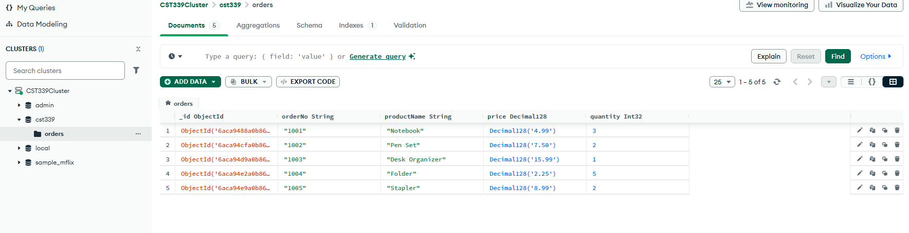](screenshots/01-atlas-orders.png) |
| 2. MongoDB orders page | The application displayed all five initial orders with matching prices and quantities. | [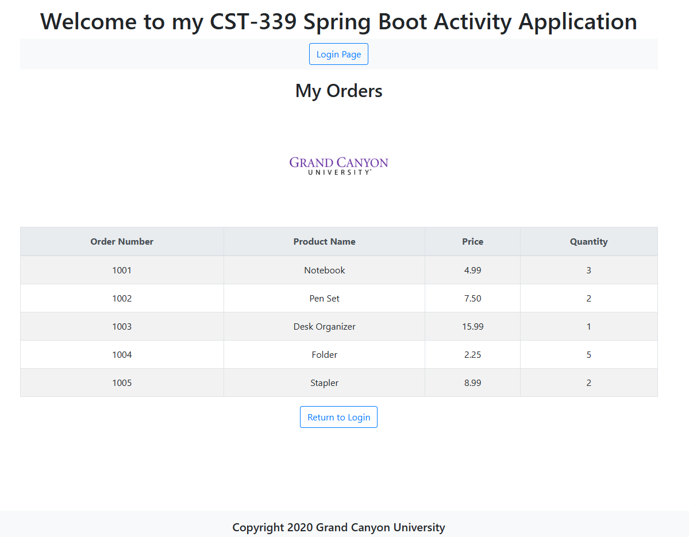](screenshots/02-mongodb-orders.png) |
| 3. JSON response | The getjson endpoint returned the five initial orders, including their document identifiers. | [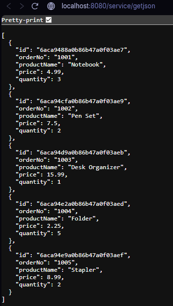](screenshots/03-mongodb-json.png) |
| 4. XML response | The getxml endpoint returned the five initial orders under the orders root element. | [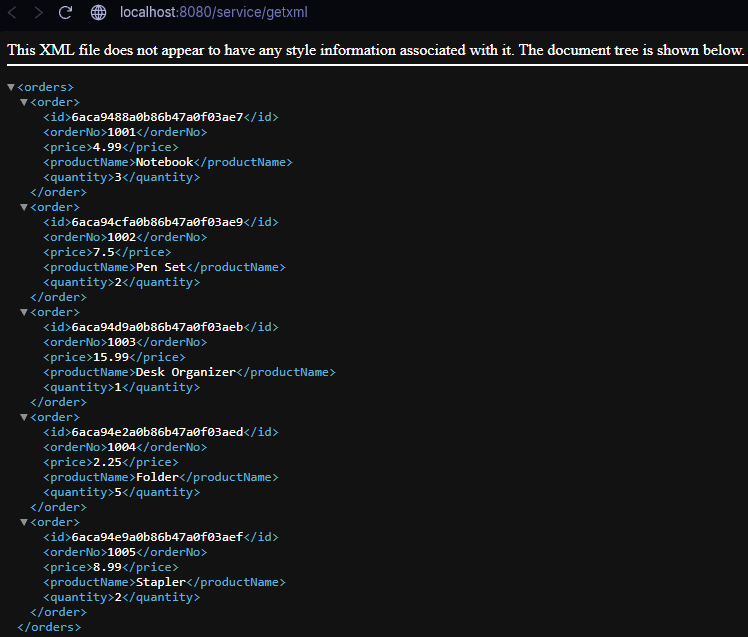](screenshots/04-mongodb-xml.png) |
| 5. Java save and read-back | The console reported that save/read verification passed for order 1006, with six total orders. | [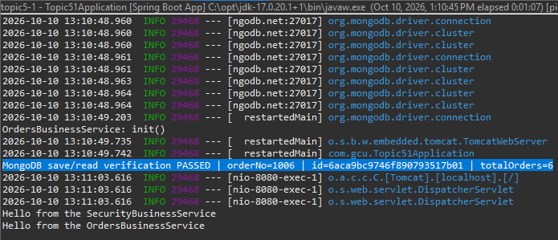](screenshots/05-mongodb-save-verification.png) |
| 6. Orders after saving | The application displayed Java Save Test with price 12.50 and quantity 2 alongside the five original orders. | [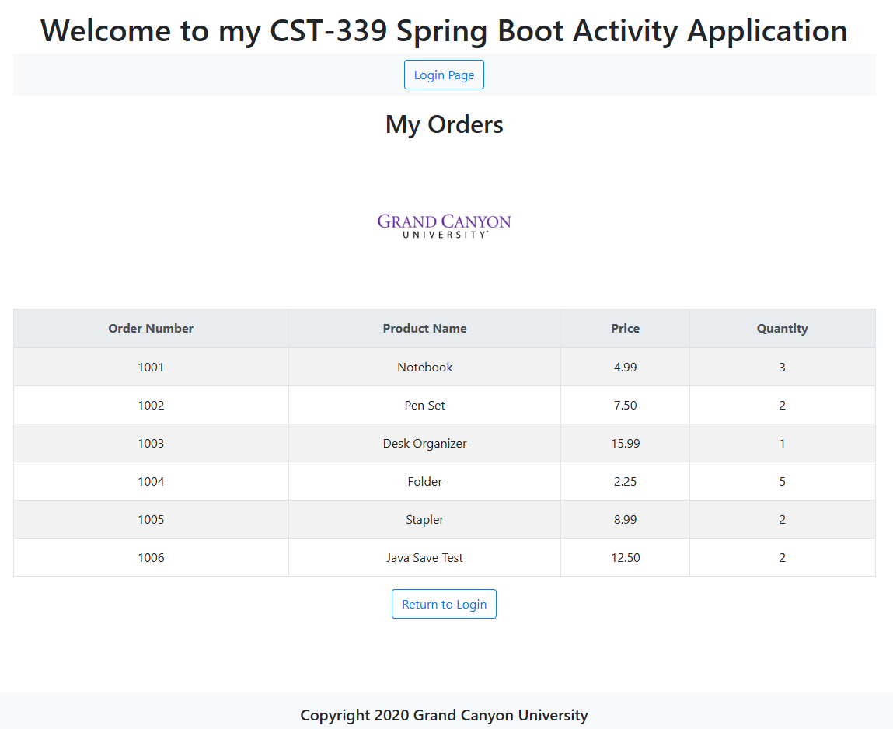](screenshots/06-orders-after-save.png) |
| 7. Existing identifier | The identifier endpoint returned order 1001, Notebook, with price 4.99 and quantity 3. | [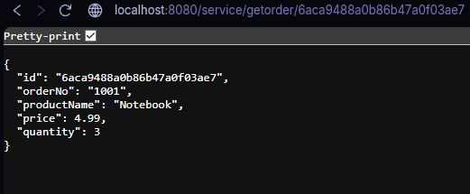](screenshots/07-order-by-id.png) |
| 8. Missing identifier | The all-zero identifier returned the JSON message Order not found. | [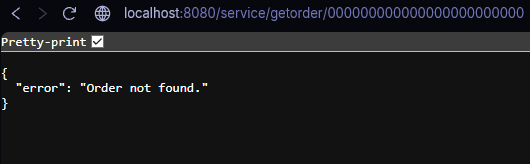](screenshots/08-order-not-found.png) |
| 9. Maven build | Maven reported BUILD SUCCESS with one test, zero failures, zero errors, and zero skipped tests. | [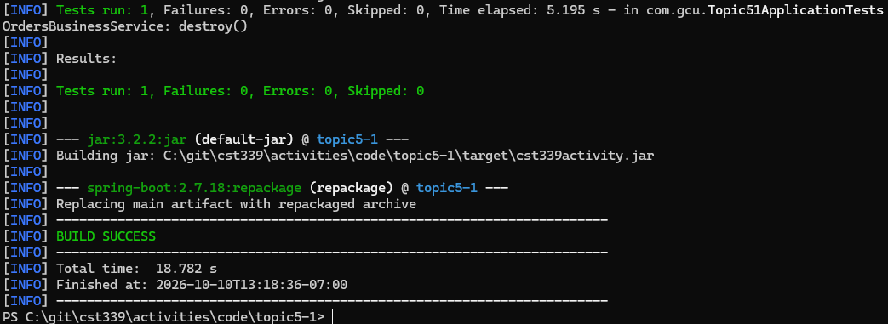](screenshots/09-maven-build-success.png) |
| 10. Executable JAR startup | The console reported Tomcat running on port 8080 and successful Topic51Application startup. | [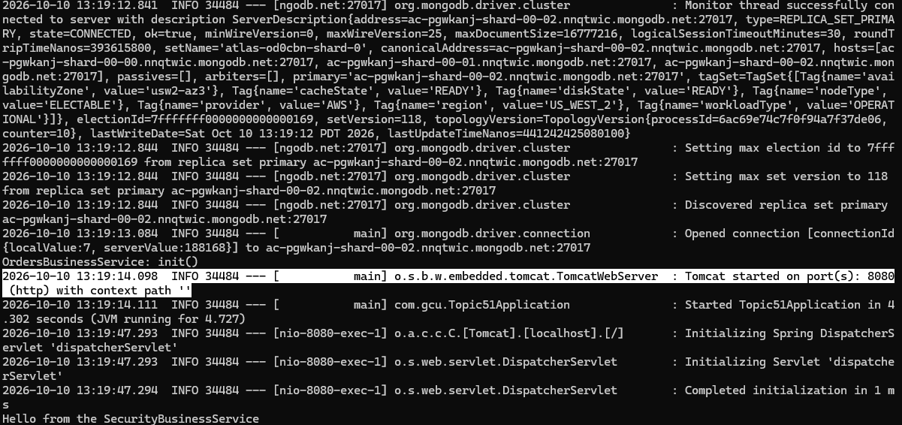](screenshots/10-executable-jar-startup.png) |
| 11. Executable JAR orders | The application running from the JAR displayed all six stored orders. | [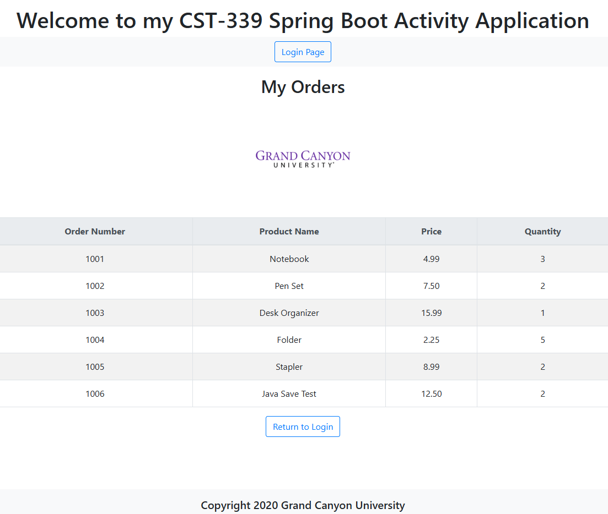](screenshots/11-executable-jar-orders.png) |

## Identifier Requests

Existing order:

```text
http://localhost:8080/service/getorder/6aca9488a0b86b47a0f03ae7
```

Observed response:

```json
{
  "id": "6aca9488a0b86b47a0f03ae7",
  "orderNo": "1001",
  "productName": "Notebook",
  "price": 4.99,
  "quantity": 3
}
```

Missing order:

```text
http://localhost:8080/service/getorder/000000000000000000000000
```

Observed response:

```json
{
  "error": "Order not found."
}
```

The controller implements HTTP 200 and HTTP 404 for these outcomes. The browser screenshots show response bodies, not the HTTP status codes, so they do not independently verify the status values.

## Save Verification

OrderSaveVerification ran with the save-test profile. It used OrdersDataService.create, which delegates to the repository's save method.

The runner then read the collection again and checked that order 1006 had a document identifier, the expected product name, price 12.50, and quantity 2. The console reported a passing result and six total orders.

The later executable JAR screenshot also shows order 1006, demonstrating that the saved record remained available across application runs.

## Testing Boundaries

- The Maven result represents one application-context test, not a complete automated functional suite.
- Browser screenshots provide the JSON, XML, and lookup evidence.
- The XML browser notice about missing style information is normal for an unstyled XML document.
- Database outage handling and the HTTP 500 response were not exercised.
- Unique-index rejection, concurrent writes, and malformed identifier behavior were not separately tested.
- Update and delete operations are not implemented or tested.
- Login is a demonstration and does not verify database-backed authentication.

## Conclusion

The observed results demonstrate MongoDB retrieval, saving and reading back an order, JSON/XML output, identifier lookup, and successful execution outside Eclipse. The Maven build completed successfully, and the packaged application displayed all six persisted orders.