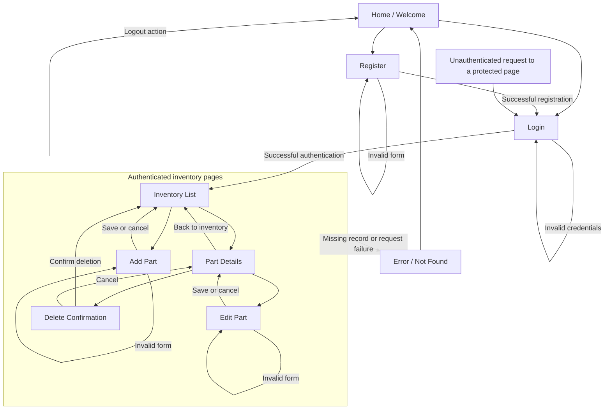

# CST-339: Milestone 1

## IT Parts Inventory Manager - Project Status and Design Report

- **Author / sole developer:** Alex Quintero
- **Instructor:** Professor Bobby Estey
- **Topic:** Topic 1 - Introduction to Spring Boot and Maven
- **Report date:** September 13, 2026
- **Revision:** 1.0 - Draft for review
- **Project approval:** Pending instructor approval
- **Repository:** [CST-339 on GitHub](https://github.com/AQuintero96/cst339)
- **Clone URL:** `https://github.com/AQuintero96/cst339.git`
- **Development approach:** Individual project, following the instructor-directed solo arrangement for the milestones.

## Project Proposal

### Introduction and Domain

IT Parts Inventory Manager is a proposed web application for tracking spare computer components in an IT department. Working in an IT role makes this a practical project because keeping track of available parts can help with repairs and upgrades. The application will provide a central inventory where authorized users can see what parts are available, how many are in stock, and where they are stored.

The managed products will include RAM, SSDs, hard drives, processors, motherboards, power supplies, graphics cards, and cooling components. Each record will represent a part model at a storage location, with a quantity representing the number of units available. Individual serial-number tracking will not be included in the initial scope.

### Planned Inventory Data

| Field | Purpose and planned validation |
| --- | --- |
| Part ID | System-generated identifier; not entered by the user |
| Part name | Required descriptive name; maximum 100 characters |
| Category | Required selection from supported component categories |
| Manufacturer | Required; maximum 60 characters |
| Model | Required; maximum 100 characters |
| Quantity | Required whole number, zero or greater |
| Unit cost | Required nonnegative decimal amount in USD, with up to two decimal places |
| Storage location | Required cabinet, shelf, or room identifier; maximum 100 characters |
| Description | Optional notes; maximum 1,000 characters |

All submitted fields will be validated on the server. Browser validation will provide additional feedback, but it will not replace server validation. Quantity changes will represent manual stock corrections; the initial application will not maintain a purchasing or stock-movement ledger.

### Planned Features and Functionality

1. **Registration:** Create an account using a name, unique username, email address, and password. Required fields, lengths, email format, and password confirmation will be checked. The final application will store password hashes rather than plaintext passwords.
2. **Login and logout:** Authenticate registered users and provide a logout action that ends their session.
3. **Inventory list:** Display all part records in a table with name, category, manufacturer, model, quantity, cost, and location.
4. **Create a part:** Allow an authenticated user to enter and save a new inventory record.
5. **View part details:** Display the complete information for a selected part.
6. **Update a part:** Allow an authenticated user to edit a record, including its quantity and location.
7. **Delete a part:** Display a confirmation page identifying the part before deleting it. Cancel will return to the record without changing it.
8. **Validation and error handling:** Show useful field-level messages, handle missing records, and provide friendly error pages without exposing database details.
9. **Responsive presentation:** Use Bootstrap with Thymeleaf templates so pages remain usable on desktop and smaller screens.
10. **Secured read APIs:** In Milestone 7, provide authenticated endpoints for listing parts and retrieving a part by ID.

The initial deployment is a course demonstration using fictional inventory and test accounts. All registered users will share the same inventory and have the same inventory permissions. This registration model is not intended to permit unrestricted enrollment in a real company's inventory system; an approval or invitation process would be needed for that use.

Purchasing, payment processing, employee equipment assignments, barcode scanning, and serial-number tracking are outside the initial scope.

## Weekly Status Summary

The following table records the time spent on Milestone 1 tasks and the estimated work remaining. Instructor approval is tracked separately from development hours.

| User story / task | Owner | Status | Hours worked | Hours Remaining |
| --- | :---: | --- | :---: | :---: |
| Describe the domain, managed products, and features | Alex Quintero | Drafted; awaiting final review | 2 | 0 |
| Draft the sitemap and technical design | Alex Quintero | Drafted; awaiting diagram verification | 2 | 0 |
| Plan solo responsibilities, milestone work, and risks | Alex Quintero | Drafted; awaiting final review | 1 | 0 |
| Verify GitHub presentation and submit proposal for approval | Alex Quintero | Pending | .2 | 0 |

**Tasks drafted:** Proposal, product data outline, functional scope, solo delivery plan, milestone schedule, technical approach, design decisions, risks, sitemap, and initial security approach.

**Screencast URL:** N/A to the proposal deliverables listed for Milestone 1.

**Peer review:** N/A - solo project.

## Planning Documentation

### Initial Planning and Solo Division of Work

A lightweight Agile approach will organize the work into weekly iterations, a prioritized backlog, and a short review and retrospective at the end of each iteration.

The project will use short weekly iterations aligned with the eight course milestones. I will be responsible for requirements, design, development, testing, documentation, and delivery. These responsibilities are separate activities performed by one developer, not assignments to additional team members.

A simple backlog will track tasks as **To Do**, **In Progress**, and **Done**. At the beginning of each iteration, the required features will be broken into smaller tasks. Required functionality will take priority over optional improvements. Each completed feature will be checked before starting another major feature.

GitHub will store source code and design reports. Commits will describe completed changes, and each milestone report will link to its supporting work. The instructor's feedback will be reviewed and added to the next iteration's task list.

| Milestone | Planned delivery | Owner |
| :---: | --- | :---: |
| 1 | Proposal, draft sitemap, solo plan, risks, and initial design report | Alex Quintero |
| 2 | Spring MVC home, registration, and login pages; Thymeleaf layouts and Bootstrap; no database | Alex Quintero |
| 3 | Create-part module; refactor registration and login into Spring services with dependency injection; no database | Alex Quintero |
| 4 | Persist users and parts using MySQL and Spring Data JDBC; package executable JAR with Maven | Alex Quintero |
| 5 | Inventory table, part details, update, and delete modules | Alex Quintero |
| 6 | Database-backed Spring Security login and protected inventory pages | Alex Quintero |
| 7 | Secured list-parts and part-details REST APIs; design and code cleanup | Alex Quintero |
| 8 | Generated JavaDoc, final application, final report, and presentation | Alex Quintero |

Reports and demonstration recordings will be supplied for the milestones that require them. The final security design is an intended outcome; early milestones will be local prototypes and will not be presented as production-secure applications.

A task will be considered done when its acceptance criteria pass, relevant error cases are checked, comments or JavaDoc are updated, required evidence is captured, and the changes are committed. Examples include rejecting negative quantities, displaying a saved part correctly, and preserving a record when deletion is canceled.

### Retrospective Results

Application development has not started during this proposal milestone. Development retrospective results will be documented in later milestones as implementation and testing are completed.

## Design Documentation

### Install Instructions

Milestone 1 contains proposal and design documentation only. There is no milestone application, database script, or deployment package to install yet.

The existing local repository is `C:\git\cst339`. The report is located at `milestones/milestone1/README.md`, and future application source will be placed under `C:\git\cst339\milestones\code`.

For a new checkout, clone the repository using the clone URL above and open the report in VS Code or GitHub. Later reports will include exact JDK requirements, database creation scripts, environment settings, build commands, and application startup steps once those components exist. External hosting instructions will be added if required; hosting has not been configured.

### General Technical Approach

The application will use an N-Layer architecture. Thymeleaf templates and Spring MVC controllers will handle presentation and requests. Business services will contain inventory rules and coordinate operations. Persistence services and repositories will use Spring Data JDBC to read and write MySQL data.

Controllers will pass validated input to business services and select the appropriate response or view. Views will display information, and model objects will carry data. Business rules will remain in the service layer rather than being placed in controllers, views, or models. Validation annotations will define input constraints without moving inventory business processes into the data models.

Spring-managed components will use constructor injection for their service and repository dependencies. Exceptions will be handled consistently, with useful messages for users and diagnostic details in application logs. Application classes will be documented using JavaDoc.

### Key Technical Design Decisions

| Technology / decision | Purpose and reason |
| --- | --- |
| Java 17 and Spring Boot 2.7.18 as the initial baseline | Use the existing validated course environment; review compatibility before implementation and confirm any required upgrade with the instructor |
| Spring MVC and Thymeleaf | Meet the presentation requirements and share page layouts |
| Bootstrap | Provide responsive forms, navigation, and tables |
| Spring services and constructor injection | Separate business operations from web and persistence code |
| MySQL with Spring Data JDBC | Meet the relational persistence requirement without introducing JPA/Hibernate |
| Java BigDecimal for cost | Represent decimal money values without binary floating-point rounding |
| Spring Security | Provide form login, access control, password encoding, and API authentication |
| Maven and embedded Tomcat | Build an executable Spring Boot JAR that can run outside Eclipse |
| GitHub and Markdown | Store source code, track revisions, and organize project documentation |
| One shared inventory and one authenticated-user role | Keep permissions understandable and achievable for a solo course project |

### Known Issues

Application defects cannot be assessed yet because implementation and testing have not started. Known code or functionality issues will be recorded here during subsequent milestones. Anticipated technical concerns are documented in the risk table below.

### Risks

| Risk | Type | Likelihood / Impact | Mitigation and Response | Owner |
| --- | --- | --- | --- | :---: |
| Work exceeds available solo development time | Planning | Medium / High | Deliver required features first, defer optional features, and review scope weekly. | Alex Quintero |
| Dependency or JDK incompatibility | Technical | Medium / High | Keep versions consistent, build early, and test instructor-approved upgrades separately. | Alex Quintero |
| Legacy framework support limitations | Technical | High / High for real deployment | Use the framework for local coursework pending review and plan a supported version before real deployment. | Alex Quintero |
| Incorrect inventory values or accidental deletion | Functional | Medium / High | Validate inputs, require delete confirmation, and test cancellation and error handling. | Alex Quintero |
| Database configuration or persistence failures | Technical | Medium / High | Test connectivity early, use parameterized database operations, and document configuration. | Alex Quintero |
| Unauthorized access or exposed credentials | Security | Medium / High | Add Spring Security at the required milestone, hash passwords, and keep secrets outside Git. | Alex Quintero |
| Concurrent edits overwrite another update | Functional | Low / Medium | Plan optimistic locking when persistence is added and report conflicts instead of silently overwriting changes. | Alex Quintero |

### ER Diagram

Deferred to detailed database design. The initial entities are **User** and **Part**. Users will authenticate into one shared inventory; this proposal does not assign ownership of each part to a user. Keys, constraints, and a complete ER diagram will be defined before database implementation in Milestone 4.

### DDL Scripts

Not applicable yet. MySQL table creation scripts will be added with persistence work and linked from GitHub.

### Sitemap Diagram

The sitemap shows the planned navigation for the completed application.

The home, registration, and login pages will be public. Inventory pages will require authentication in the completed security implementation. Invalid forms will keep the user on the same page and show validation messages. A shared navigation layout will provide inventory and logout actions throughout the protected pages. Logout is an action rather than a separate content page.

A delete confirmation will identify the selected part. The actual deletion will require a protected state-changing request; following a normal page link will not delete data. Error responses will show safe recovery guidance rather than stack traces or database details.

### User Interface Diagrams

Optional wireframe diagrams are deferred for Milestone 1. The draft layout will use a shared Bootstrap navigation bar, clearly labeled forms, and a responsive inventory table. The list will provide an Add Part button and links to individual records. Detailed layouts will be refined with the Spring MVC pages in Milestone 2.

### Class Diagrams

Deferred until detailed implementation design. The planned responsibilities are inventory controllers, a part business service, persistence components, and separate user and part data models. The class diagram will be updated when actual fields, interfaces, and method signatures are established.

### Service API Design

Two read endpoints are planned for Milestone 7:

- `GET /api/parts` - return the inventory records.
- `GET /api/parts/{id}` - return the requested part or a not-found response.

Both endpoints will require Spring Security authentication backed by the database, using at least HTTP Basic authentication as required by the overview. HTTPS will be required outside the local development environment. Detailed JSON fields, response codes, and examples will be documented when the API is designed and implemented.

### Security Design

The final application will distinguish anonymous visitors from authenticated users. Anonymous visitors may view the home page, register, and log in. Authenticated users may list, view, create, update, and delete inventory records. Attempts to open protected UI pages without authentication will redirect to login. Unauthenticated API requests will receive an authentication failure response.

Spring Security will handle form authentication and logout. Passwords will be stored using an appropriate password encoder such as BCrypt. Form submissions that change data will retain CSRF protection. Database credentials will be supplied through local configuration or environment variables rather than committed secrets. All application users will initially have the same inventory privileges; separate administrator roles are outside this proposal's scope.

### Other Documentation and Approval

This report is the initial project proposal and draft design. The project will be submitted to Professor Estey for approval before detailed development proceeds. Approval has not yet been given. Any requested changes will be reflected in a new report revision and the project backlog.

## Conclusion

IT Parts Inventory Manager provides a practical way to apply the course requirements to an IT-related problem. Its scope supports registration, login, inventory CRUD operations, relational persistence, and secured APIs while remaining manageable for one developer. The milestone plan allows the application to grow gradually, with testing and documentation included throughout the project.

## Course References

- CST-339 CLC Project Overview, supplied as `CST-339 CLC Project Overview.doc`.
- CST-339 Project Design Report Template, supplied as `CST-339-RS-ProjectDesignReportTemplate.docx`.
- [Professor's Milestone 1 requirements](https://gitlab.com/bobby.estey/gcu-cst339/-/tree/main/milestones/milestone01).
- [Professor's Markdown report example](https://gitlab.com/bobby.estey/gcu-cst339/-/blob/main/milestones/milestone01/example01.md).
