# Milestone 3: Services and Part Creation

**Project:** IT Parts Inventory Manager  
**Author:** Alex Quintero  
**Course:** CST-339  
**Date:** September 26, 2026  
**Time spent:** Approximately 9 hours  
**Development:** Individual project

[Watch the Milestone 3 demonstration](https://youtu.be/jWA0RCb9LVA)

The video is unlisted and was checked in a private browser window.

## Work Completed

This milestone adds a working part creation form to the application. Users can enter component details, correct validation errors, and review accepted information on a confirmation page.

Registration and login now depend on service interfaces through constructor injection. The application continues to use the shared navy and teal theme from Milestone 2.

Completed work includes:

- Added interfaces for account, registration, and part services.
- Updated registration and login controllers to use the service interfaces.
- Created the part model, service, controller, form, and confirmation page.
- Added Add Part links to the navigation and inventory page.
- Checked required fields, negative values, numeric formats, and cost precision.
- Checked phone and tablet layouts using DevTools emulation.
- Updated the proposed database script for this milestone.
- Built the application with Java 17 and Maven.
- Recorded a technical and functional demonstration.

Part records are not saved in this version. Database persistence is planned for Milestone 4.

## Planning and Progress

The work followed this order. Each step built on the existing Milestone 2 application.

| Order | Task | Status |
|---|---|---|
| 1 | Refactor registration and login around service interfaces | Completed |
| 2 | Verify registration, invalid login, and successful login | Completed |
| 3 | Create the part model and business service | Completed |
| 4 | Add the controller, form, and confirmation page | Completed |
| 5 | Connect part creation to the application navigation | Completed |
| 6 | Test validation and responsive layouts | Completed |
| 7 | Build with Java 17 and Maven | Completed |
| 8 | Carry forward the database design and update documentation | Included in this report |
| 9 | Record and check the screencast link | Completed |

Approximately nine hours were spent on development, testing, and recording.

## General Technical Approach

The application uses Spring Boot 2.7.18 with Java 17. Spring MVC handles requests, Thymeleaf renders the pages, and Bean Validation checks submitted form values.

Controllers handle page navigation and form results. Business services handle account operations, password confirmation, and part creation. Controllers receive those services through constructor injection.

The service implementations use `@Service`, allowing Spring to discover and manage them. Their interfaces define the operations available to the controllers.

Registration stores accounts in memory. Login checks those accounts and creates a session containing the username and first name. Restarting the application removes the registered accounts.

Part creation processes a validated submission and assigns a temporary ID. The result is passed to a confirmation page through a flash attribute. It is not added to a saved inventory collection.

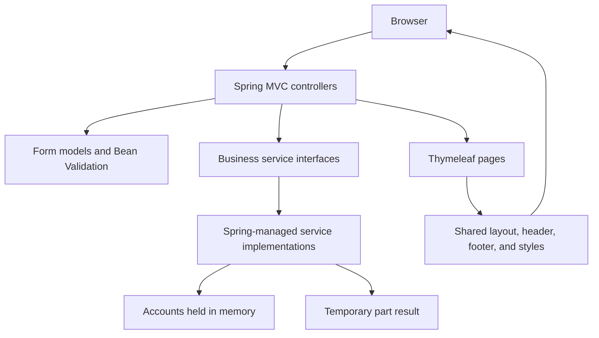
```mermaid
flowchart TD
    Browser["Browser"] --> Controllers["Spring MVC controllers"]
    Controllers --> Validation["Form models and Bean Validation"]
    Controllers --> Interfaces["Business service interfaces"]
    Interfaces --> Services["Spring-managed service implementations"]
    Services --> Accounts["Accounts held in memory"]
    Services --> PartResult["Temporary part result"]
    Controllers --> Views["Thymeleaf pages"]
    Views --> Layout["Shared layout, header, footer, and styles"]
    Layout --> Browser
```

## Key Technical Decisions

| Decision | Reason |
|---|---|
| Constructor injection through interfaces | Makes each controller's dependencies clear and separates controllers from service implementations. |
| Spring-managed services | Lets Spring create and supply the business services. |
| Shared Thymeleaf layout | Keeps navigation, styles, and footer consistent across pages. |
| Server-side validation | Checks values submitted to the controller, including values that do not match the form's expected format. |
| `BigDecimal` for unit cost | Represents decimal cost values without using binary floating-point arithmetic. |
| Allowed form fields | Prevents users from setting the system-assigned part ID through form binding. |
| Redirect after successful part submission | Separates the submission from the confirmation page. |
| Temporary part IDs | Supports the demonstration without introducing database persistence early. |
| Shared inventory | Matches the project proposal, where parts are available to the team rather than owned by individual users. |

## Application Theme

The final theme uses a navy header, teal action buttons, a light page background, and white content cards.

| Element | Value |
|---|---|
| Main font | Segoe UI, with Arial and sans-serif fallbacks |
| Header | `#14263d` |
| Primary accent | `#78dfcf` |
| Page background | `#f5f7fa` |
| Main text | `#203047` |
| Framework | Bootstrap with custom CSS |

All pages use `layouts/defaultTemplate.html`. Shared navigation and footer fragments are defined in `layouts/common.html`.

On narrow screens, form fields stack vertically and navigation collapses into a menu. Wider screens display related fields in two columns.

## Installation and Configuration

The application source is in [the shared milestone application](../code/it-parts-inventory).

Requirements:

- JDK 17
- An internet connection for the initial Maven dependency download
- Port 8080 available
- Browser access to the Bootstrap CDN for its styles and scripts

No database configuration is required for this milestone.

From PowerShell, open the application directory:

```powershell
Set-Location 'C:\git\cst339\milestones\code\it-parts-inventory'
```

On the development computer, Java 17 can be selected for the current terminal session with:

```powershell
$env:JAVA_HOME = 'C:\opt\jdk-17.0.20.1+1'
$env:Path = "$env:JAVA_HOME\bin;$env:Path"
```

Other computers should use their own JDK 17 installation path.

Build and test:

```powershell
.\mvnw.cmd clean package
```

Run the application:

```powershell
java -jar target\it-parts-inventory.jar
```

Open `http://localhost:8080/`.

The project can also be imported into Eclipse as an existing Maven project and run as a Spring Boot application. Stop another application using port 8080 before starting it.

Register a sample account before testing login. Accounts must be registered again after an application restart.

## Sitemap

The diagram shows the main navigation and submission paths. It does not represent access-control rules.

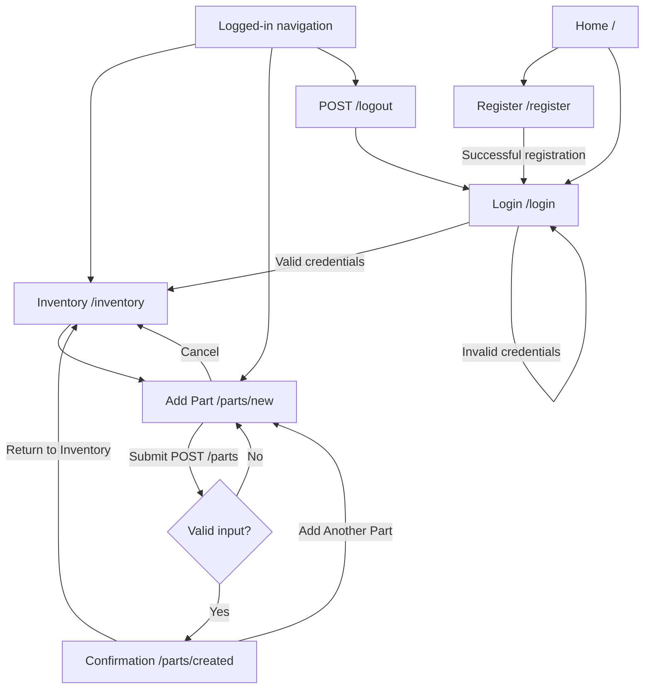
```mermaid
flowchart TD
    Home["Home /"] --> Register["Register /register"]
    Home --> Login["Login /login"]
    Register -->|Successful registration| Login
    Login -->|Valid credentials| Inventory["Inventory /inventory"]
    Login -->|Invalid credentials| Login
    Inventory --> Add["Add Part /parts/new"]
    Nav["Logged-in navigation"] --> Inventory
    Nav --> Add
    Add -->|Submit POST /parts| Validate{"Valid input?"}
    Validate -->|No| Add
    Validate -->|Yes| Created["Confirmation /parts/created"]
    Add -->|Cancel| Inventory
    Created -->|Add Another Part| Add
    Created -->|Return to Inventory| Inventory
    Nav --> Logout["POST /logout"]
    Logout --> Login
```

## User Interface Wireframes

These diagrams show the main sections of each page. They describe the layout rather than the exact appearance. Screenshots of the implemented pages are included later in this report.

### Home Page

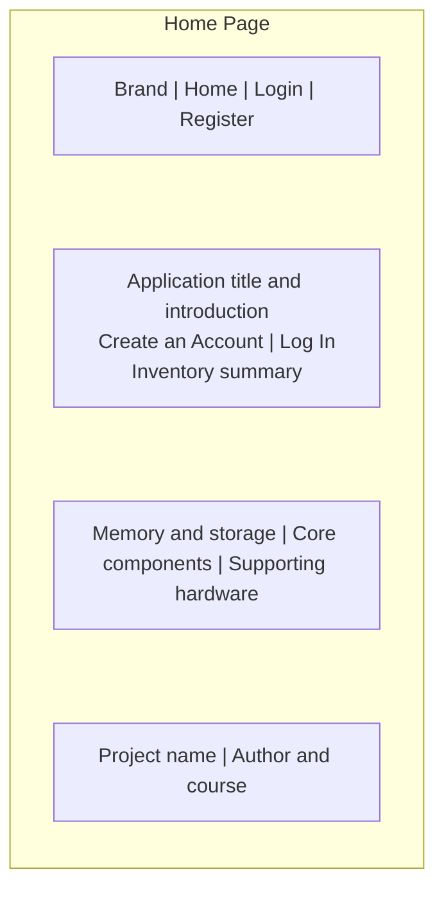
```mermaid
flowchart TB
    subgraph HomePage["Home Page"]
        direction TB
        HNav["Brand | Home | Login | Register"]
        HHero["Application title and introduction<br/>Create an Account | Log In<br/>Inventory summary"]
        HCards["Memory and storage | Core components | Supporting hardware"]
        HFooter["Project name | Author and course"]
        HNav ~~~ HHero ~~~ HCards ~~~ HFooter
    end
```

### Registration Page

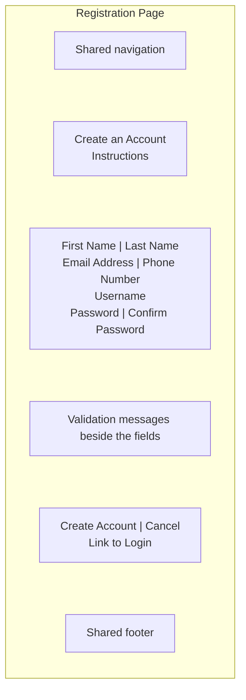
```mermaid
flowchart TB
    subgraph RegistrationPage["Registration Page"]
        direction TB
        RNav["Shared navigation"]
        RTitle["Create an Account<br/>Instructions"]
        RFields["First Name | Last Name<br/>Email Address | Phone Number<br/>Username<br/>Password | Confirm Password"]
        RErrors["Validation messages beside the fields"]
        RActions["Create Account | Cancel<br/>Link to Login"]
        RFooter["Shared footer"]
        RNav ~~~ RTitle ~~~ RFields ~~~ RErrors ~~~ RActions ~~~ RFooter
    end
```

### Login Page

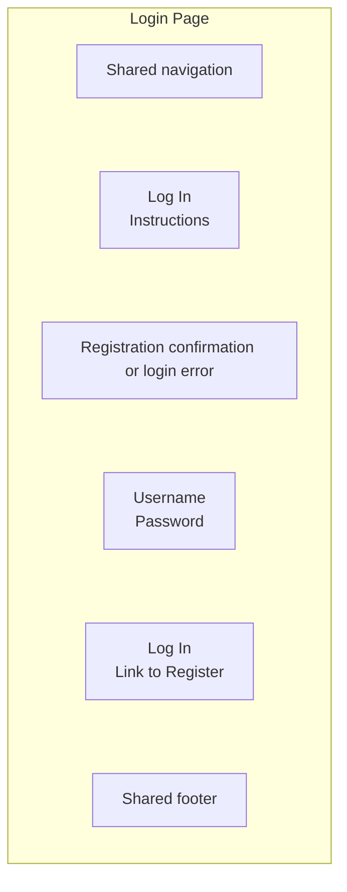
```mermaid
flowchart TB
    subgraph LoginPage["Login Page"]
        direction TB
        LNav["Shared navigation"]
        LTitle["Log In<br/>Instructions"]
        LMessage["Registration confirmation or login error"]
        LFields["Username<br/>Password"]
        LActions["Log In<br/>Link to Register"]
        LFooter["Shared footer"]
        LNav ~~~ LTitle ~~~ LMessage ~~~ LFields ~~~ LActions ~~~ LFooter
    end
```

### Inventory Page

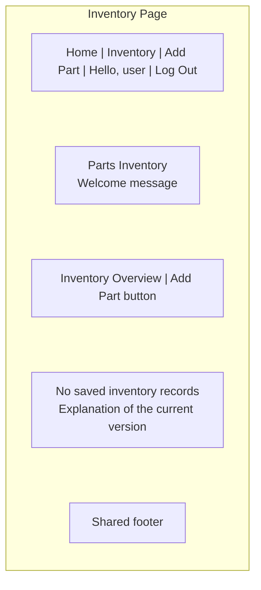
```mermaid
flowchart TB
    subgraph InventoryPage["Inventory Page"]
        direction TB
        INav["Home | Inventory | Add Part | Hello, user | Log Out"]
        ITitle["Parts Inventory<br/>Welcome message"]
        IOverview["Inventory Overview | Add Part button"]
        INotice["No saved inventory records<br/>Explanation of the current version"]
        IFooter["Shared footer"]
        INav ~~~ ITitle ~~~ IOverview ~~~ INotice ~~~ IFooter
    end
```

### Add Part Page

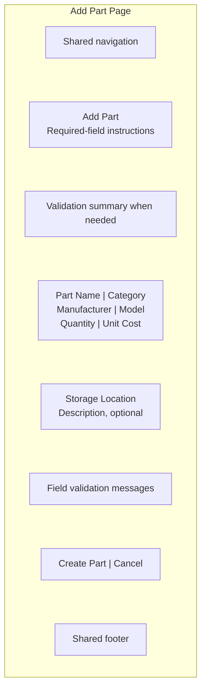
```mermaid
flowchart TB
    subgraph AddPartPage["Add Part Page"]
        direction TB
        PNav["Shared navigation"]
        PTitle["Add Part<br/>Required-field instructions"]
        PSummary["Validation summary when needed"]
        PFields["Part Name | Category<br/>Manufacturer | Model<br/>Quantity | Unit Cost"]
        PDetails["Storage Location<br/>Description, optional"]
        PErrors["Field validation messages"]
        PActions["Create Part | Cancel"]
        PFooter["Shared footer"]
        PNav ~~~ PTitle ~~~ PSummary ~~~ PFields ~~~ PDetails ~~~ PErrors ~~~ PActions ~~~ PFooter
    end
```

### Part Confirmation Page

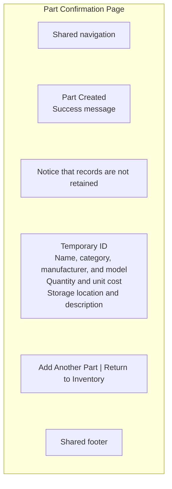
```mermaid
flowchart TB
    subgraph ConfirmationPage["Part Confirmation Page"]
        direction TB
        CNav["Shared navigation"]
        CTitle["Part Created<br/>Success message"]
        CNotice["Notice that records are not retained"]
        CDetails["Temporary ID<br/>Name, category, manufacturer, and model<br/>Quantity and unit cost<br/>Storage location and description"]
        CActions["Add Another Part | Return to Inventory"]
        CFooter["Shared footer"]
        CNav ~~~ CTitle ~~~ CNotice ~~~ CDetails ~~~ CActions ~~~ CFooter
    end
```

## Database Design

The proposed database contains `app_users` and `parts`.

There is no user-to-part foreign key because the application uses one shared inventory. User accounts do not own individual part records.

`PK` identifies a primary key. `UK` identifies a unique key.

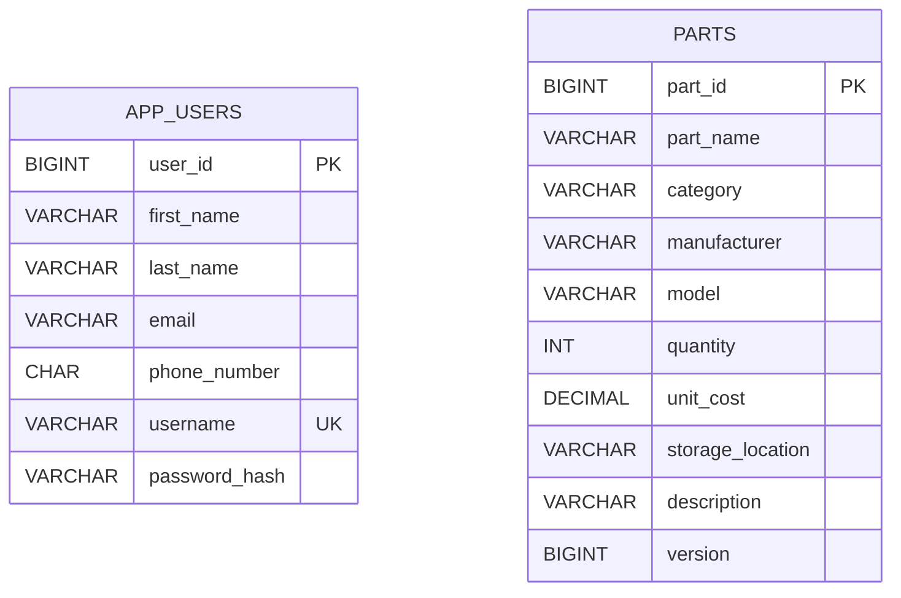
```mermaid
erDiagram
    APP_USERS {
        BIGINT user_id PK
        VARCHAR first_name
        VARCHAR last_name
        VARCHAR email
        CHAR phone_number
        VARCHAR username UK
        VARCHAR password_hash
    }

    PARTS {
        BIGINT part_id PK
        VARCHAR part_name
        VARCHAR category
        VARCHAR manufacturer
        VARCHAR model
        INT quantity
        DECIMAL unit_cost
        VARCHAR storage_location
        VARCHAR description
        BIGINT version
    }
```

### DDL Script

[View the proposed database script](database/schema-draft.sql)

The script targets MySQL 8.0.16 or later. It is design documentation and has not been executed as part of this milestone.

The parts table matches the creation form:

| Field | Planned database rule |
|---|---|
| Part name | Required, up to 100 characters |
| Category | Required, one of the eight supported categories |
| Manufacturer | Required, up to 60 characters |
| Model | Required, up to 100 characters |
| Quantity | Integer, zero or greater |
| Unit cost | `DECIMAL(12,2)`, zero or greater |
| Storage location | Required, up to 100 characters |
| Description | Optional, up to 1,000 characters |

The database will eventually assign part IDs. The current business service assigns temporary IDs instead.

The proposed `version` column is reserved for detecting conflicting updates when persistence is implemented. It is not currently a field in `PartModel`.

The planned password column will hold an encoded value containing the password hash and the information needed to verify it. The current account service keeps its password data in memory.

## Class Design

### Controllers and Services

This diagram includes all current controllers and their service dependencies. Method parameter lists are shortened to keep the diagram readable.

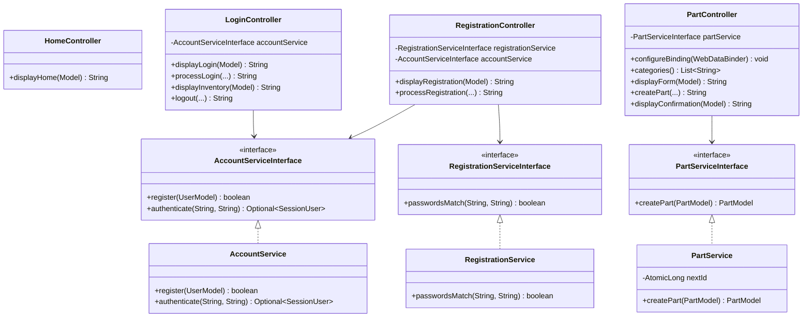
```mermaid
classDiagram
    class HomeController {
        +displayHome(Model) String
    }

    class RegistrationController {
        -RegistrationServiceInterface registrationService
        -AccountServiceInterface accountService
        +displayRegistration(Model) String
        +processRegistration(...) String
    }

    class LoginController {
        -AccountServiceInterface accountService
        +displayLogin(Model) String
        +processLogin(...) String
        +displayInventory(Model) String
        +logout(...) String
    }

    class PartController {
        -PartServiceInterface partService
        +configureBinding(WebDataBinder) void
        +categories() List~String~
        +displayForm(Model) String
        +createPart(...) String
        +displayConfirmation(Model) String
    }

    class AccountServiceInterface {
        <<interface>>
        +register(UserModel) boolean
        +authenticate(String, String) Optional~SessionUser~
    }

    class RegistrationServiceInterface {
        <<interface>>
        +passwordsMatch(String, String) boolean
    }

    class PartServiceInterface {
        <<interface>>
        +createPart(PartModel) PartModel
    }

    class AccountService {
        +register(UserModel) boolean
        +authenticate(String, String) Optional~SessionUser~
    }

    class RegistrationService {
        +passwordsMatch(String, String) boolean
    }

    class PartService {
        -AtomicLong nextId
        +createPart(PartModel) PartModel
    }

    RegistrationController --> AccountServiceInterface
    RegistrationController --> RegistrationServiceInterface
    LoginController --> AccountServiceInterface
    PartController --> PartServiceInterface
    AccountServiceInterface <|.. AccountService
    RegistrationServiceInterface <|.. RegistrationService
    PartServiceInterface <|.. PartService
```

### Object Models

Form models provide constructors and accessors for binding. `SessionUser` holds the limited account information used by the session.

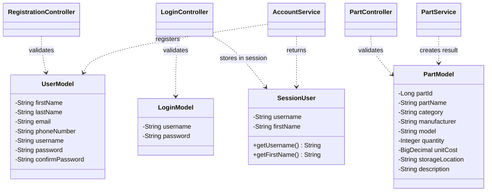
```mermaid
classDiagram
    class UserModel {
        -String firstName
        -String lastName
        -String email
        -String phoneNumber
        -String username
        -String password
        -String confirmPassword
    }

    class LoginModel {
        -String username
        -String password
    }

    class SessionUser {
        -String username
        -String firstName
        +getUsername() String
        +getFirstName() String
    }

    class PartModel {
        -Long partId
        -String partName
        -String category
        -String manufacturer
        -String model
        -Integer quantity
        -BigDecimal unitCost
        -String storageLocation
        -String description
    }

    RegistrationController ..> UserModel : validates
    LoginController ..> LoginModel : validates
    LoginController ..> SessionUser : stores in session
    PartController ..> PartModel : validates
    AccountService ..> UserModel : registers
    AccountService ..> SessionUser : returns
    PartService ..> PartModel : creates result
```

## Validation and Test Results

Manual checks covered the registration and login refactor, part creation, and responsive layouts.

| Check | Result |
|---|---|
| Valid registration after refactoring | Redirected to login with a success message |
| Incorrect login credentials | Displayed an error |
| Correct login credentials | Opened Inventory with personalized navigation |
| Empty part form | Displayed required-field errors |
| Negative quantity and cost | Rejected both values |
| Quantity `1.5` and cost `abc` | Displayed numeric conversion errors |
| Cost `49.999` | Rejected the extra decimal place |
| Quantity `0` and cost `0.00` | Accepted |
| Valid part submission | Displayed the submitted details and temporary ID |
| Both Add Part links | Opened the creation form |
| Phone layout emulation | Displayed stacked fields and readable errors |
| Tablet layout emulation | Displayed the form in two columns |
| Maven build with Java 17 | Completed successfully |

The Maven build ran one application test with zero failures, zero errors, and zero skipped tests. That test does not replace the manual form checks shown below.

### 1. Registration After Refactoring

Successful registration redirects to login and displays a confirmation.

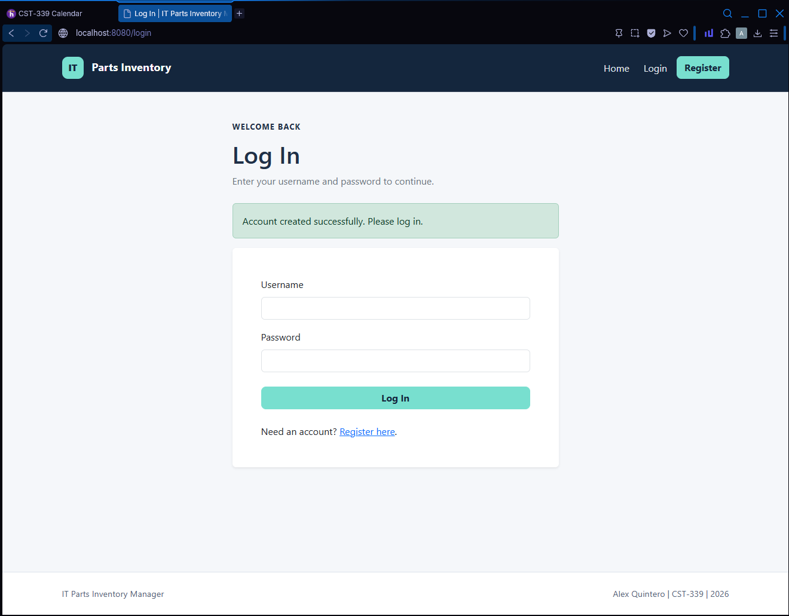

### 2. Invalid Login

Incorrect credentials display an error on the login form.

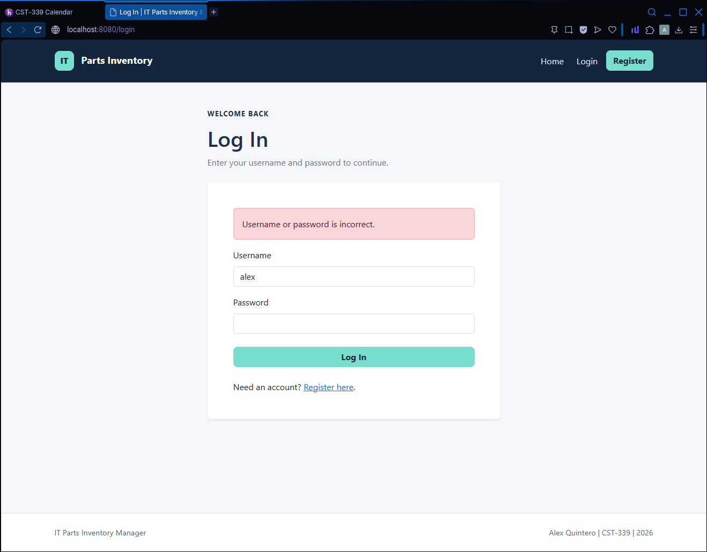

### 3. Successful Login

Successful login opens Inventory and displays the user's first name.

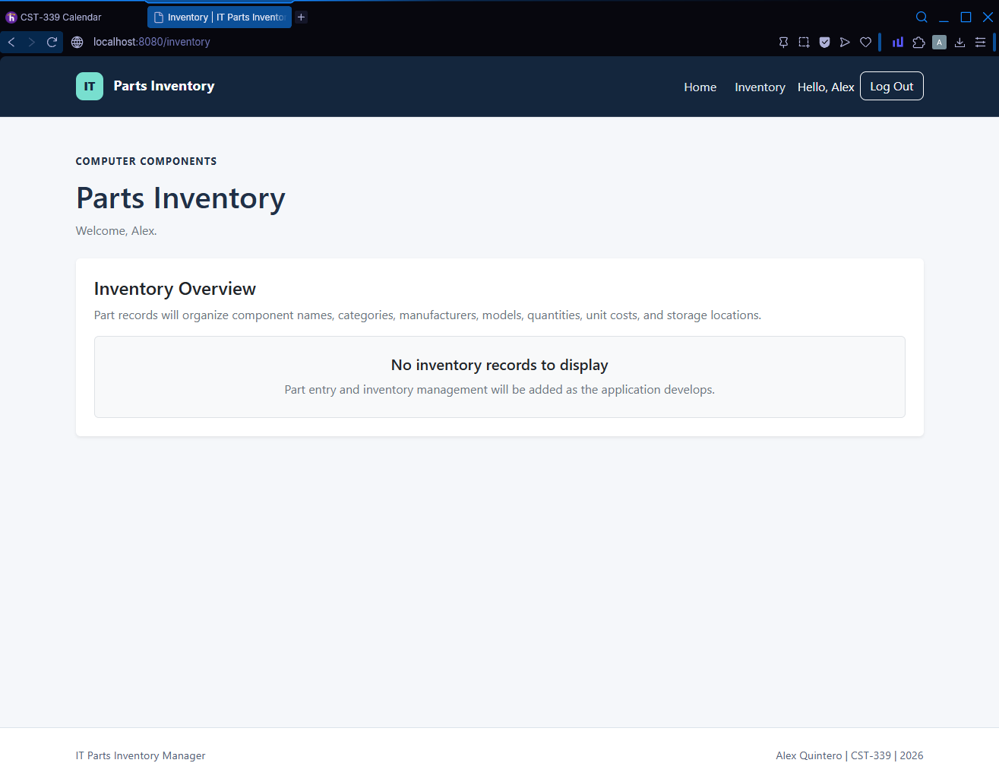

### 4. Add Part Form

The form includes component details, quantity, cost, and storage information.

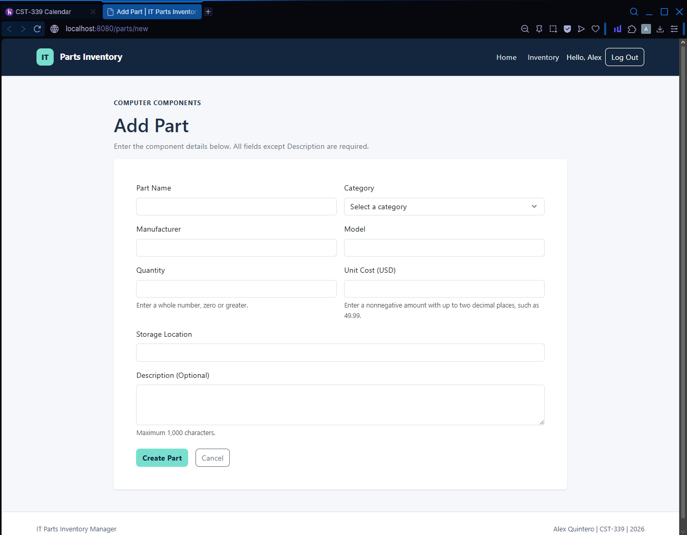

### 5. Required Fields

An empty submission displays validation messages. Description remains optional.

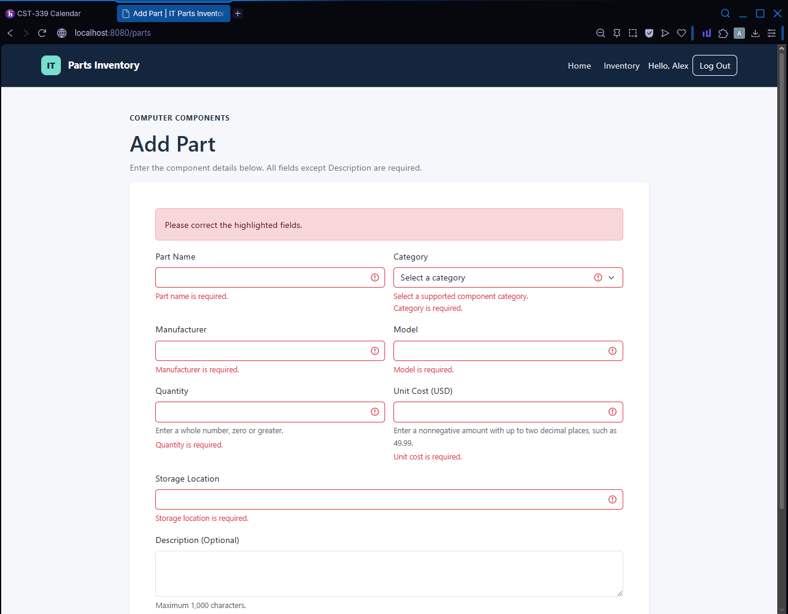

### 6. Negative Values

Negative quantity and cost are rejected while the other entries remain filled in.

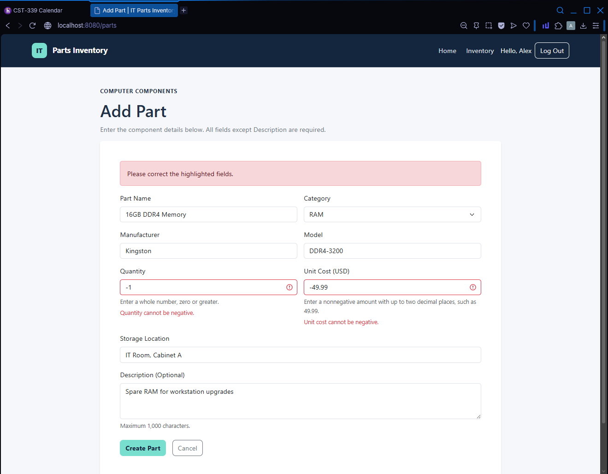

### 7. Successful Part Submission

The confirmation page displays the accepted information and explains that records are not retained.

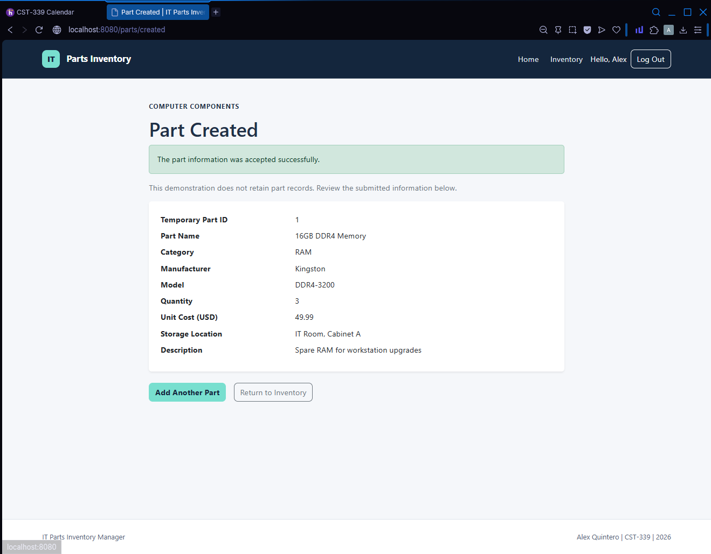

### 8. Inventory Navigation

Part creation can be opened from the navigation or the inventory page button.

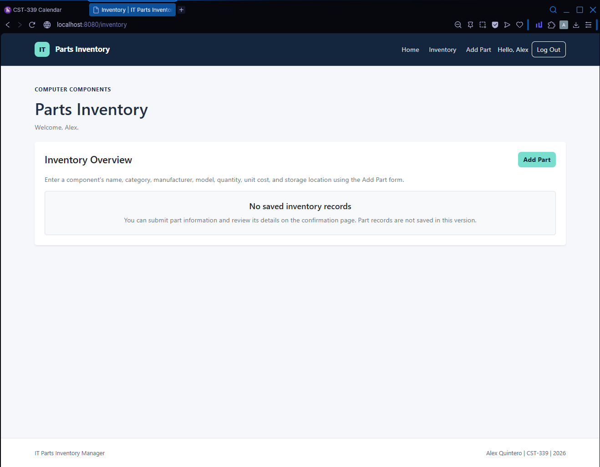

### 9. Number Formats

A decimal quantity and nonnumeric cost display readable errors.

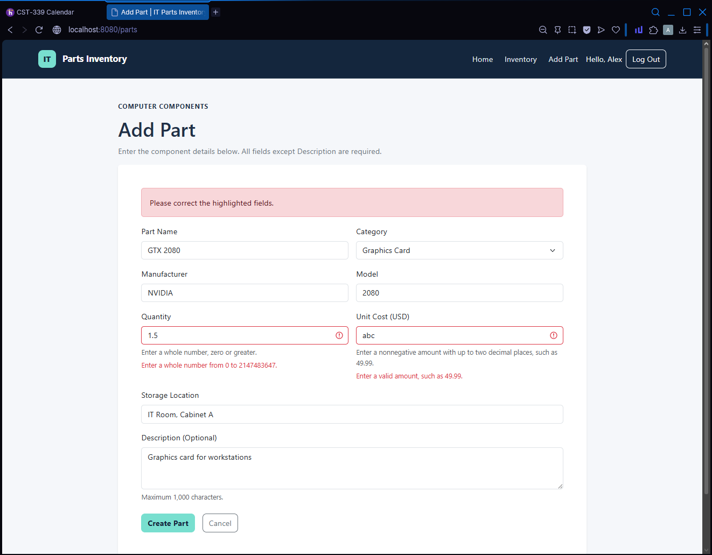

### 10. Cost Precision

Costs with more than two decimal places are rejected.

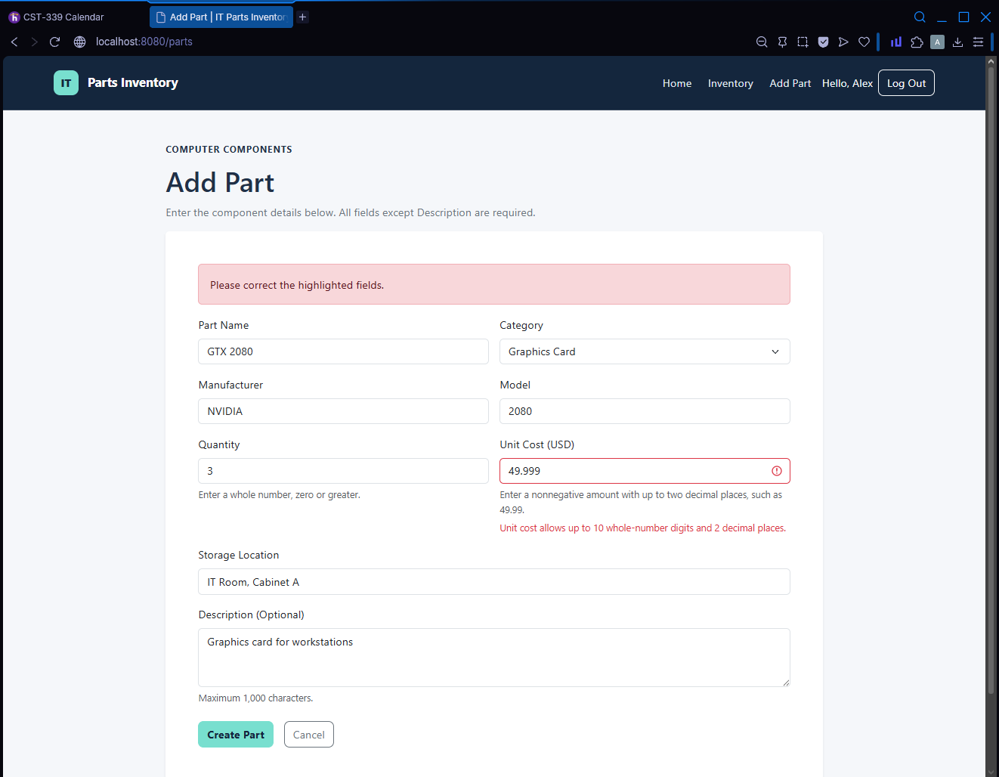

### 11. Phone Layout

The iPhone 16 Pro Max layout was checked using browser DevTools emulation, not a physical phone.

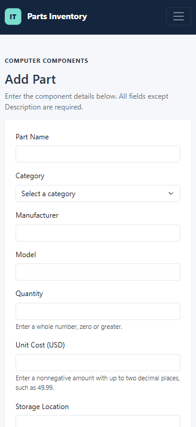

### 12. Phone Validation Messages

The emulated phone layout keeps validation messages beneath their fields.

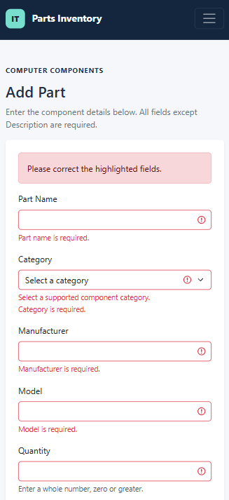

### 13. Tablet Layout

The iPad Pro 13 layout was checked using DevTools emulation.

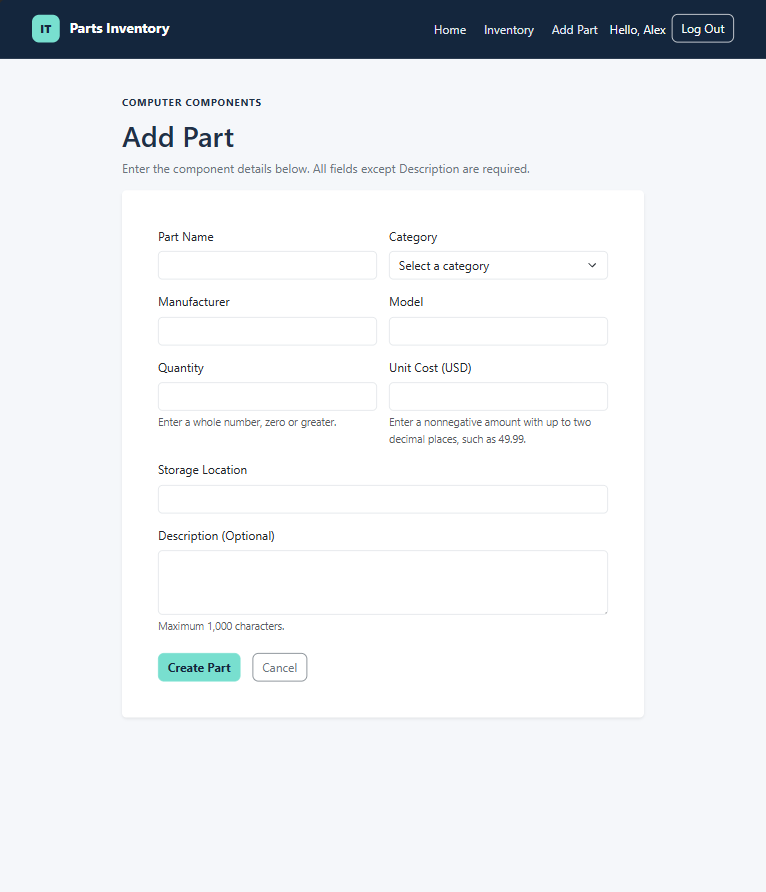

### 14. Maven Build

The application built successfully using Java 17.0.20.1.

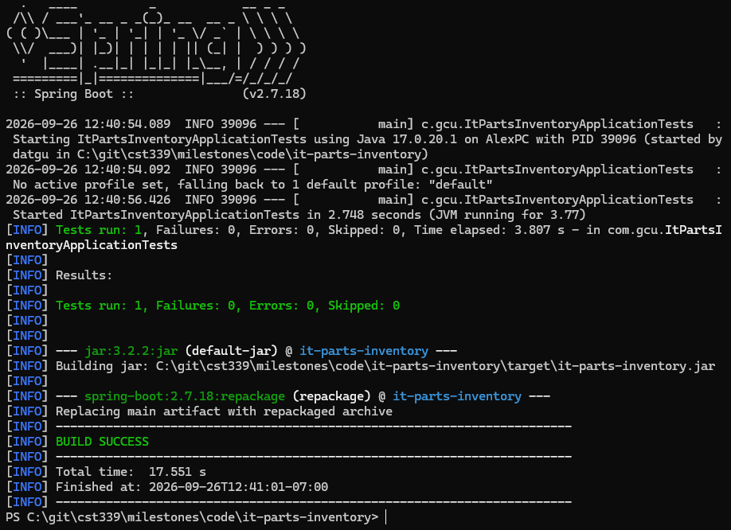

## Code Documentation and Review

This is an individual project. No teammate peer review is claimed.

The controllers and services include documentation describing their responsibilities and methods. Inline comments explain details such as starting a fresh login session, limiting form binding, assigning temporary IDs, and passing confirmation data through a redirect.

The templates include comments describing shared layout sections and form behavior. The SQL script explains which features are planned for later persistence work.

Before submission, the remaining self-review should include:

- Confirming that Cancel returns to Inventory.
- Confirming logout ends the session.
- Confirming an empty optional Description is accepted.
- Checking the rendered README diagrams and links on GitHub.

## Known Issues and Limitations

- Part submissions are not saved. The confirmation page is a temporary review of the submitted information.
- Accounts are stored in memory and are removed when the application restarts.
- Temporary part IDs restart when the application restarts.
- An empty category currently displays both the required-field message and the supported-category message.
- Navigation changes with the session, but inventory and part routes do not yet enforce authentication.
- The database script has not been executed or tested against MySQL.
- Phone and tablet screenshots show emulation rather than physical-device testing.
- Automated testing currently covers application startup. The form behavior was checked manually.

## Risks and Next Steps

The database implementation will need to preserve the form's validation rules and replace temporary IDs with database-generated IDs. Account persistence will also need a consistent encoded password format.

Bootstrap is loaded from a CDN, so its styles and scripts depend on network access or cached browser resources.

The next milestone will add persistence. Later work will expand inventory management and access control as required by the project.

## Project Links

- [Milestone 3 screencast](https://youtu.be/jWA0RCb9LVA)
- [Application source](../code/it-parts-inventory)
- [Database design script](database/schema-draft.sql)
- [Milestone 2 report](../milestone2/README.md)
- [Repository front page](../../README.md)