# Milestone 4: Design and Setup

[Overview](README.md) | [Analysis and Planning](analysisPlanning.md) | [Testing](test.md)

## Installation and Configuration

### Requirements

- Java 17
- MySQL
- Maven Wrapper included with the project
- Port 8080 available
- Internet access for initial Maven dependencies and Bootstrap CDN resources

The development environment uses Spring Boot 2.7.18 and MySQL 5.7.24.

### Database Setup

Open [schema.sql](database/schema.sql) in MySQL Workbench and execute it using an administrative connection.

The script creates:

- Database: it_parts_inventory
- Account table: app_users
- Inventory table: parts

It does not drop existing tables. It also does not modify the structure of tables that already exist.

The application uses the cst339_app account created during Activity 4. An administrator grants it access with:

```sql
GRANT SELECT, INSERT, UPDATE, DELETE
ON it_parts_inventory.*
TO 'cst339_app'@'localhost';
```

On another computer, create an application account with a locally chosen password before granting access. Do not commit credentials to the repository.

### Application Properties

```properties
spring.application.name=it-parts-inventory

# Connects to the milestone database.
spring.datasource.url=jdbc:mysql://127.0.0.1:3306/it_parts_inventory
spring.datasource.username=cst339_app

# Reads the password from the launch environment.
spring.datasource.password=${DB_PASSWORD}

# Schema creation is managed through the documented SQL script.
spring.sql.init.mode=never
```

The project uses spring-boot-starter-jdbc and MySQL Connector/J. JdbcTemplate and the connection pool are configured by Spring Boot.

### Running in Eclipse

1. Import the application as an existing Maven project.
2. Select Java 17 and update the Maven project.
3. Open its Spring Boot run configuration.
4. Add DB_PASSWORD under Environment.
5. Start MySQL.
6. Run the application and open http://localhost:8080/.

Stop other applications using port 8080 first.

### Building and Running Outside Eclipse

On the development computer:

```powershell
Set-Location 'C:\git\cst339\milestones\code\it-parts-inventory'

$env:JAVA_HOME = 'C:\opt\jdk-17.0.20.1+1'
$env:Path = "$env:JAVA_HOME\bin;$env:Path"

$dbCredential = Get-Credential -UserName 'cst339_app' -Message 'Enter your database password'
$env:DB_PASSWORD = $dbCredential.GetNetworkCredential().Password

.\mvnw.cmd clean package
java -jar target\it-parts-inventory.jar
```

Adjust the project and Java paths on another computer. Eclipse environment settings do not automatically carry over to PowerShell.

Press Ctrl+C to stop the JAR. Saved accounts and parts remain in MySQL.

## Sitemap

These paths describe navigation and form submissions, not enforced access-control rules.

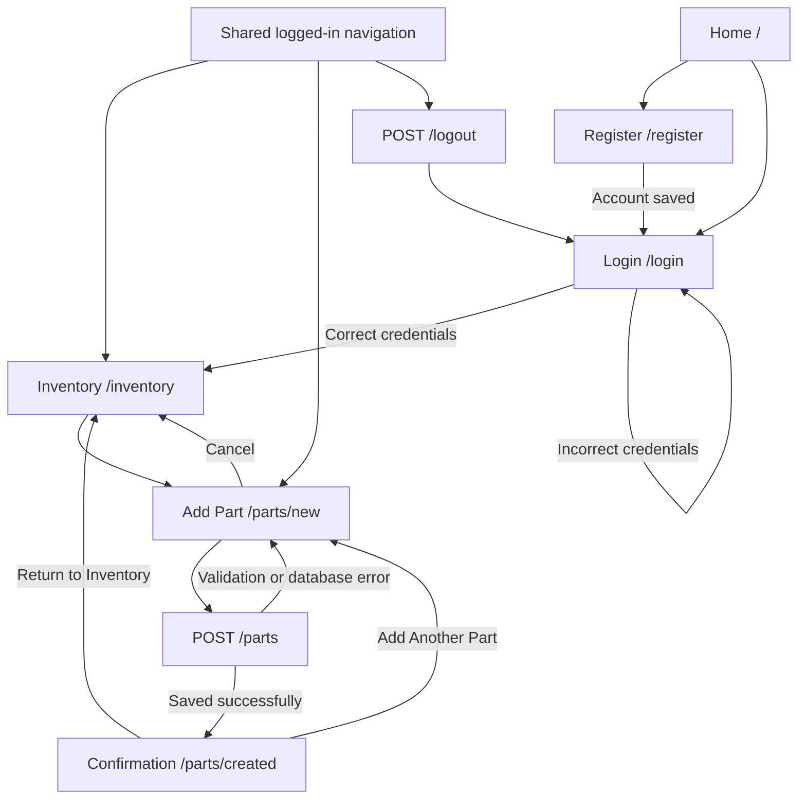

## User Interface Pages

Click a preview to open its full image. Home and registration previews come from Milestone 2; they show the established layout. The other previews show Milestone 4.

These are implementation screenshots. The Mermaid wireframes follow the table.

| Page Name | Description | Preview | Page Name | Description | Preview |
| --- | --- | --- | --- | --- | --- |
| Home | Introduces the application and links to account entry. | [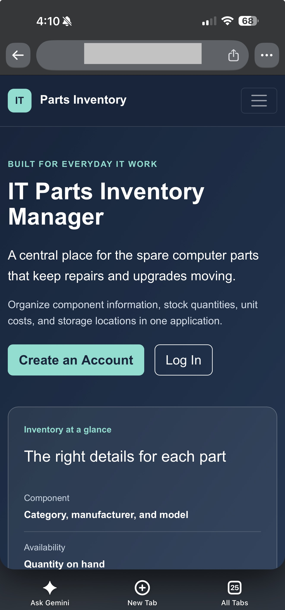](../milestone2/screenshots/15-mobile-home.png) | Registration | Collects account details and displays validation errors. | [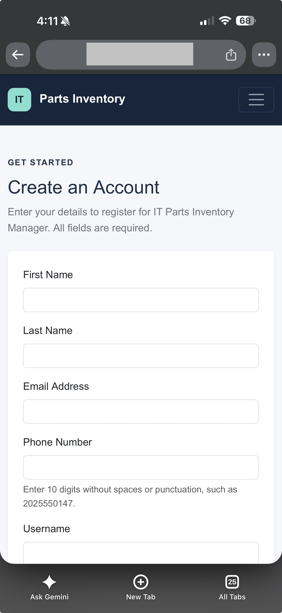](../milestone2/screenshots/16-mobile-registration.png) |
| Login | Checks stored credentials and displays errors. | [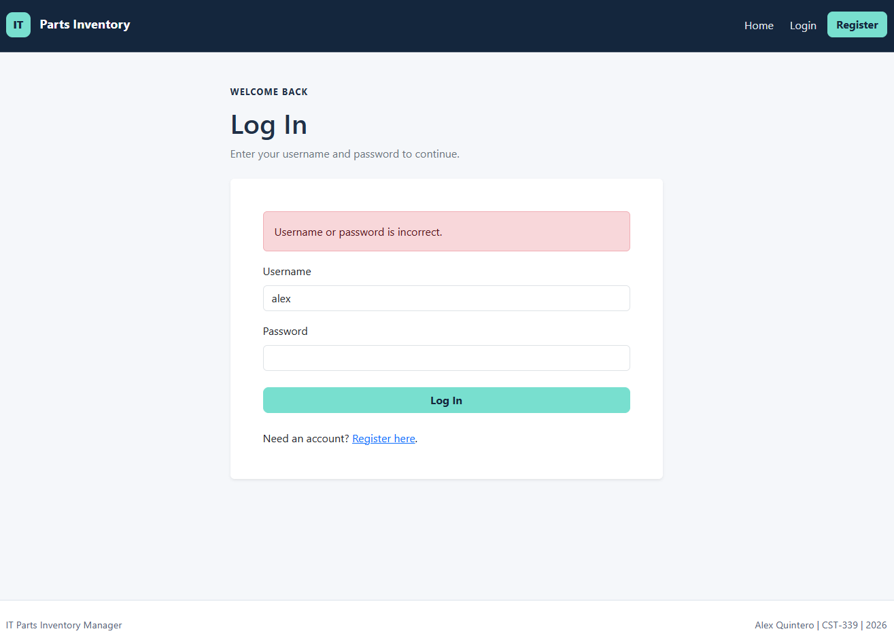](screenshots/08-invalid-database-login.png) | Inventory | Welcomes the user and links to part creation. | [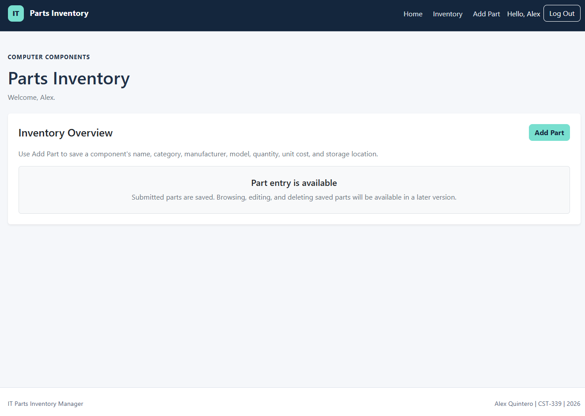](screenshots/12-executable-jar-login.png) |
| Add Part | Collects and validates component information. | [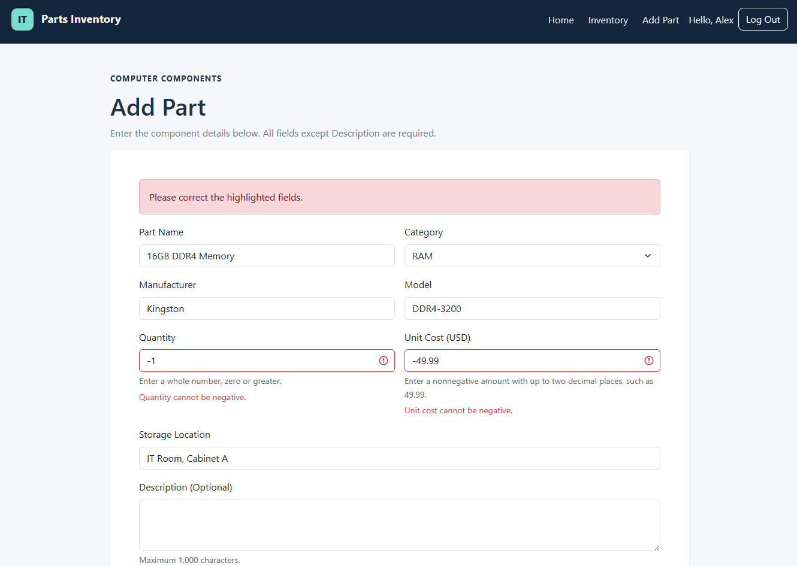](screenshots/09-invalid-part-values.png) | Confirmation | Shows the saved submission and database ID. | [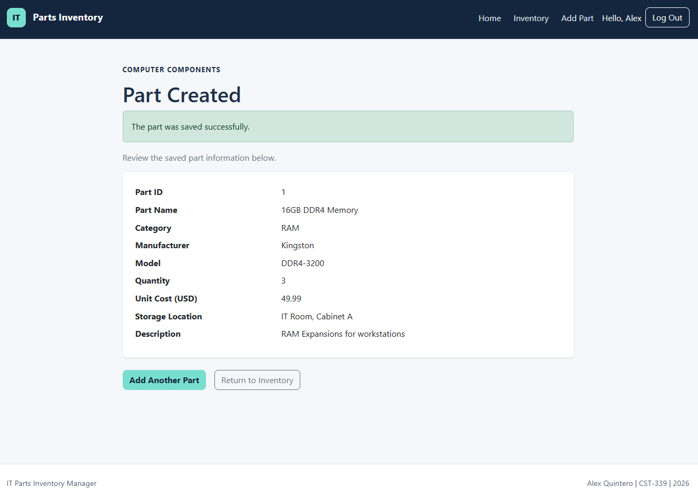](screenshots/05-database-part-created.png) |

### Mermaid Wireframes

All pages use the shared Thymeleaf layout. The diagrams show content sections rather than exact dimensions.

<details>
<summary>Home and Registration</summary>

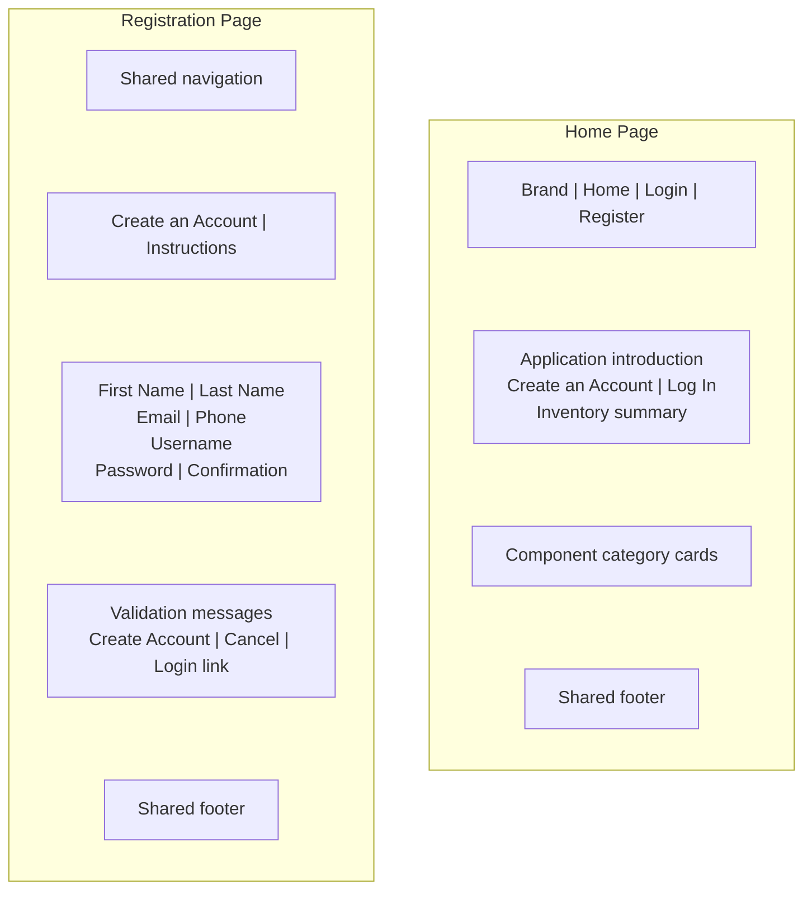

</details>

<details>
<summary>Login and Inventory</summary>

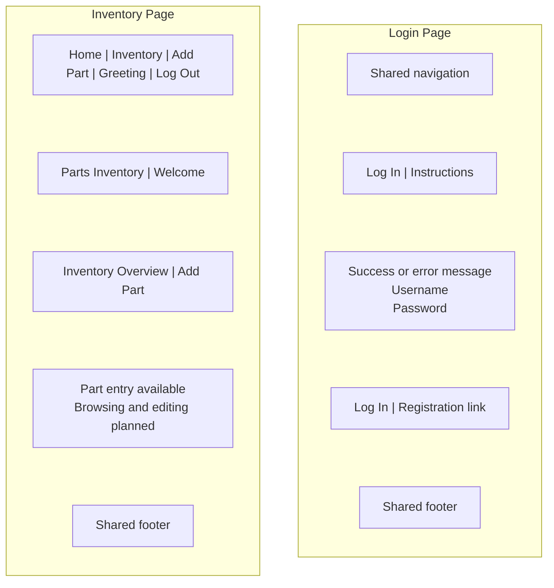

</details>

<details>
<summary>Add Part and Confirmation</summary>

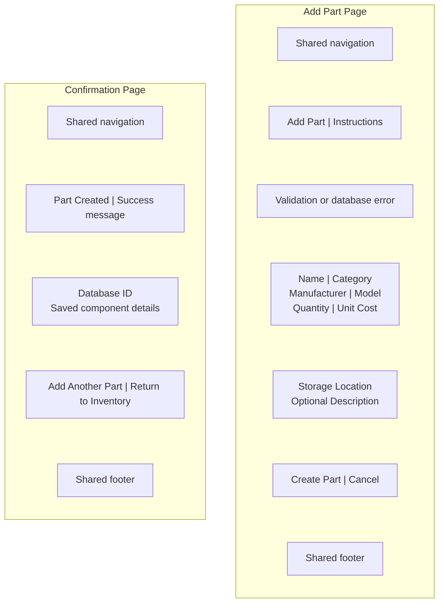

</details>

## Database Design

[View the complete DDL script](database/schema.sql)

The inventory is shared, so parts do not have an owner foreign key. PK means primary key, and UK means unique key.

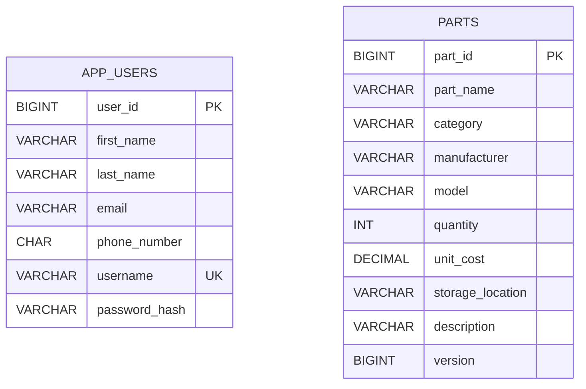

### Account Storage

Names allow 50 characters each, email allows 254, phone contains 10 characters, and username allows 32. Username uniqueness uses the database's case-insensitive collation.

The password_hash column allows 255 characters. It stores the algorithm, iteration count, Base64 salt, and Base64 hash. Password confirmation is never persisted.

### Part Storage

| Field | Definition |
| --- | --- |
| part_id | Auto-increment primary key |
| part_name | Required, maximum 100 characters |
| category | Required, maximum 30 characters |
| manufacturer | Required, maximum 60 characters |
| model | Required, maximum 100 characters |
| quantity | Required integer |
| unit_cost | Required DECIMAL(12,2) |
| storage_location | Required, maximum 100 characters |
| description | Optional, maximum 1,000 characters |
| version | Defaults to zero; reserved for later update handling |

Java validation restricts categories and rejects negative quantity and cost values. MySQL 5.7.24 does not enforce CHECK constraints, although primary keys, uniqueness, and NOT NULL constraints still apply.

The version column is not currently mapped in PartModel.

## Class Design

### Business and Persistence Services

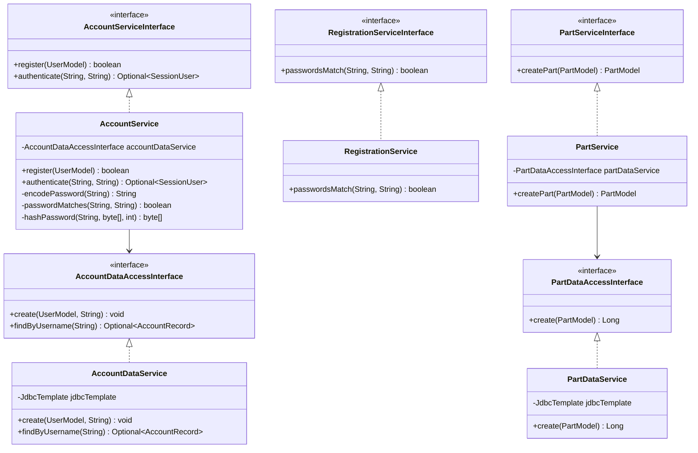

### Object Models

Accessors are omitted from the diagram for readability. Form models expose getters and setters. AccountRecord and SessionUser expose read access to their stored values.

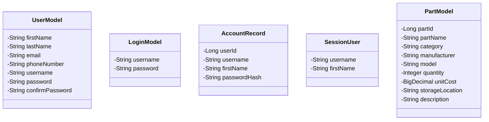

### Controller Dependencies

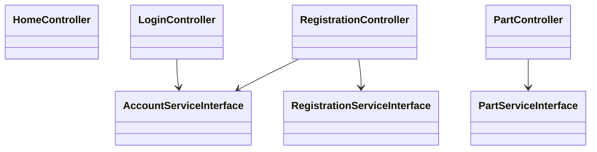

HomeController displays the home page. RegistrationController handles account forms. LoginController handles login, logout, and the inventory landing page. PartController handles creation and confirmation.

## Part Creation Transaction

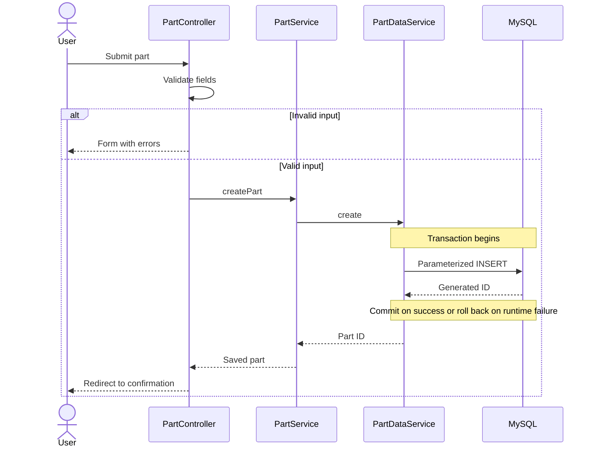

Database failures propagate to the controller, which returns the form with an error message. The confirmation page is shown only after a successful service result.

[Return to Milestone 4](README.md)