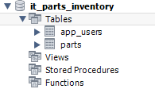
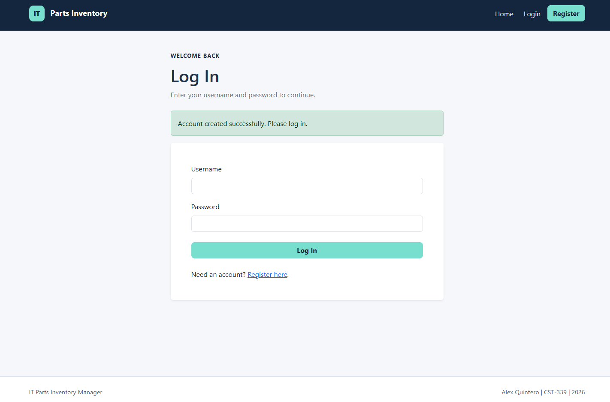
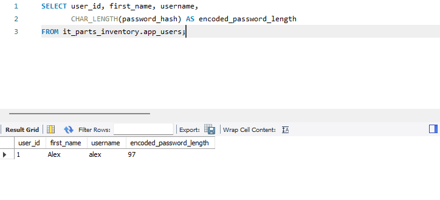
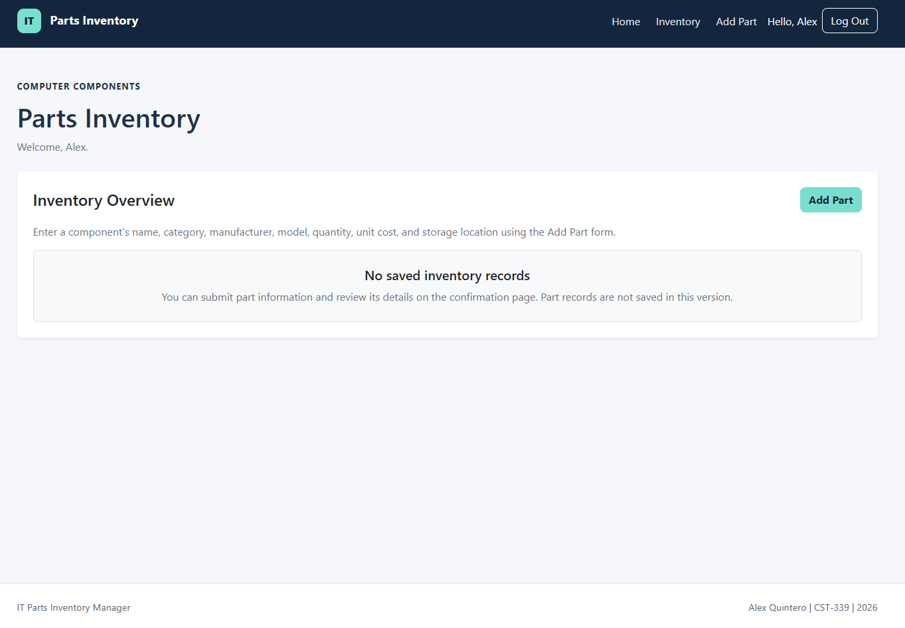
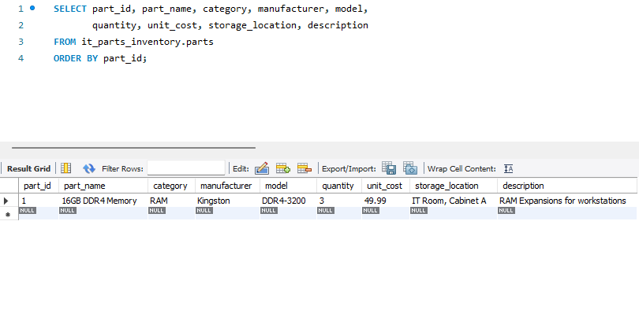
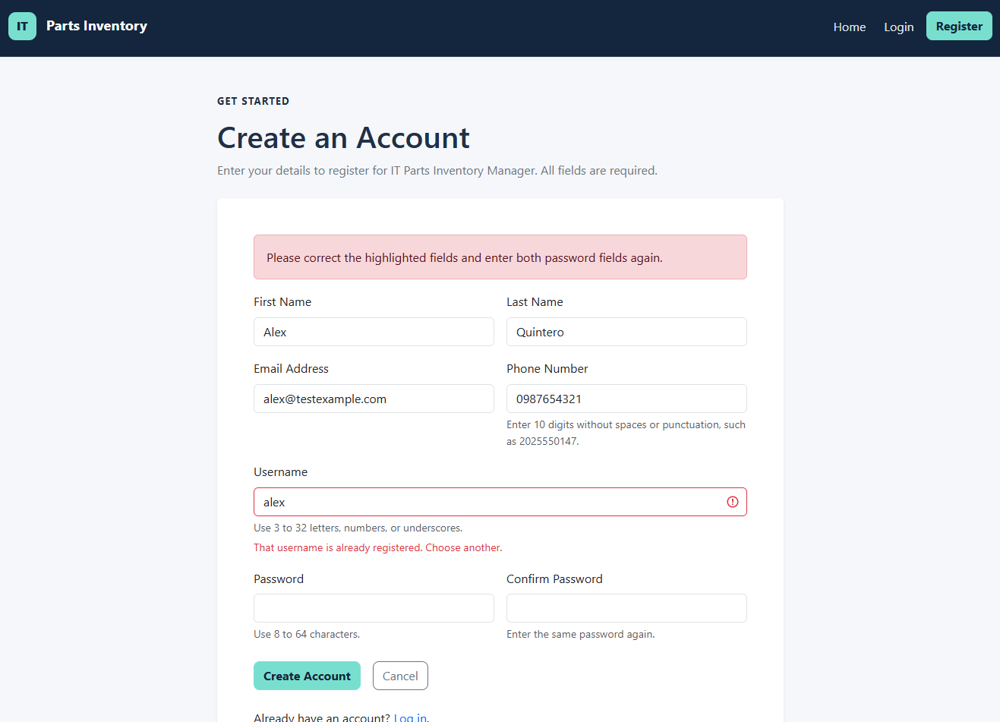
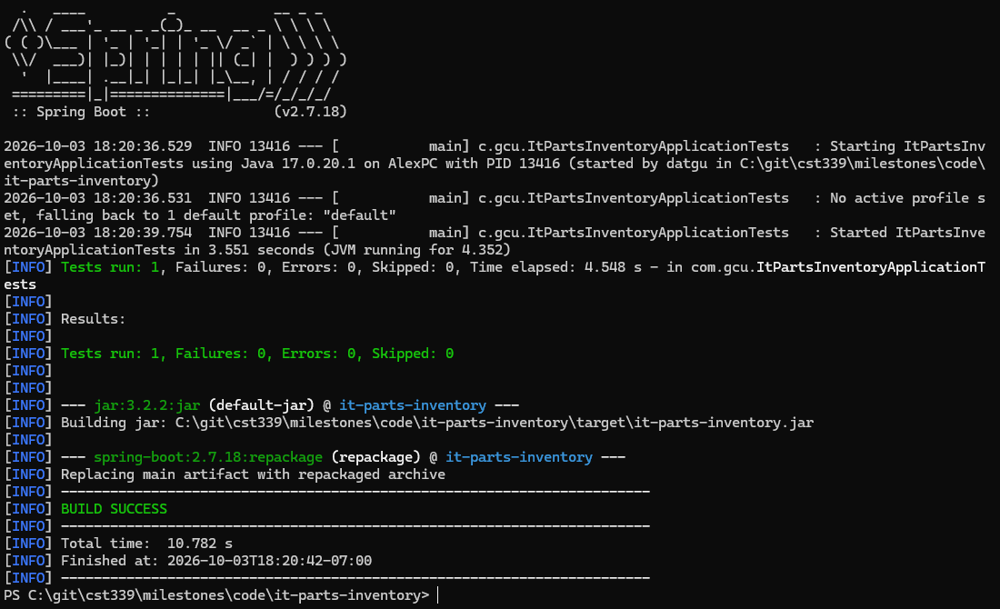
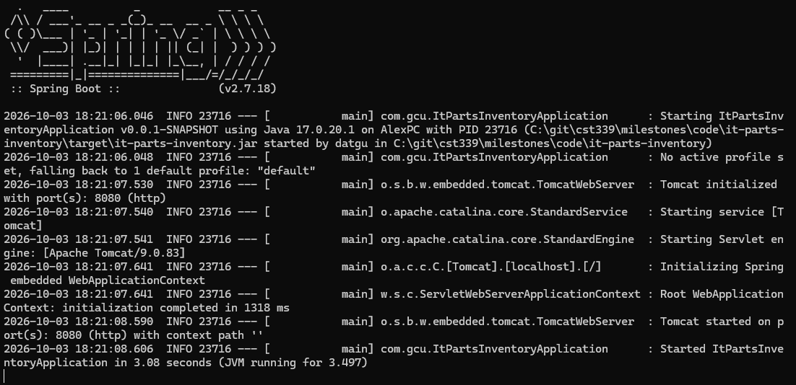

# Milestone 4: Testing and Screenshots

[Overview](README.md) | [Analysis and Planning](analysisPlanning.md) | [Design and Setup](design.md)

## Test Environment

- Java 17.0.20.1
- Spring Boot 2.7.18
- MySQL 5.7.24
- MySQL Workbench
- Eclipse and PowerShell
- Local application on port 8080

## Test Results

| Check | Expected Result | Observed Result |
| --- | --- | --- |
| Database setup | Account and part tables exist | Created app_users and parts |
| Valid registration | Account saved and login page displayed | Registration confirmation displayed |
| Stored account | Account row contains encoded credentials | Account found with an encoded credential length of 97 |
| Login after restart | Existing account still authenticates | Login succeeded without registering again |
| Valid part creation | Part saved with a database ID | Confirmation displayed Part ID 1 |
| Part persistence | Record remains after application restart | Matching record remained in MySQL |
| Duplicate username | Registration rejected | Username field displayed a duplicate-account message |
| Incorrect password | Login rejected | Invalid-credentials message displayed |
| Negative quantity and cost | Submission rejected without an insert | Validation errors displayed and part count remained 1 |
| Maven package build | Build and tests pass | BUILD SUCCESS with one passing test |
| Executable JAR startup | Application starts outside Eclipse | Started from PowerShell on port 8080 |
| Login through executable JAR | Saved credentials work outside Eclipse | Existing account logged in successfully |

## Screenshot Evidence

Click a thumbnail to open the full image.

| Test | Description | Screenshot |
| --- | --- | --- |
| 1. Database tables | The inventory database contains app_users and parts. | [](screenshots/01-database-tables.png) |
| 2. Registration | Successful registration redirects to login with a confirmation message. | [](screenshots/02-database-registration.png) |
| 3. Stored account | Workbench shows the account and encoded credential length without displaying the hash. | [](screenshots/03-stored-account.png) |
| 4. Login after restart | The saved account successfully logs in after restarting the application. | [](screenshots/04-login-after-restart.png) |
| 5. Part creation | The confirmation displays the saved component information and database-generated ID. | [](screenshots/05-database-part-created.png) |
| 6. Retained part | Workbench shows the saved part after restarting the application. | [](screenshots/06-part-after-restart.png) |
| 7. Duplicate username | Reusing alex displays an error beside the username field. | [](screenshots/07-duplicate-username.png) |
| 8. Incorrect password | Invalid credentials return an error on the login page. | [](screenshots/08-invalid-database-login.png) |
| 9. Invalid part values | Negative quantity and cost display validation errors. | [](screenshots/09-invalid-part-values.png) |
| 10. Maven build | Java 17 build completed with one test, zero failures, zero errors, and zero skipped tests. | [](screenshots/10-maven-build-success.png) |
| 11. JAR startup | The packaged application starts from PowerShell outside Eclipse. | [](screenshots/11-executable-jar-startup.png) |
| 12. JAR login | The application running from the JAR accepts the saved account credentials. | [](screenshots/12-executable-jar-login.png) |

## Database Verification

### Account Storage

The following query confirmed the account existed without exposing its encoded credentials:

```sql
SELECT user_id, first_name, username,
       CHAR_LENGTH(password_hash) AS encoded_password_length
FROM it_parts_inventory.app_users;
```

The result showed user ID 1, username alex, and an encoded credential length of 97. The length documents the stored value; it does not independently prove the password hashing implementation is correct.

Successful authentication after restart also confirmed that login could use the stored credentials.

### Part Storage

The following query was rerun after restarting the application:

```sql
SELECT part_id, part_name, category, manufacturer, model,
       quantity, unit_cost, storage_location, description
FROM it_parts_inventory.parts
ORDER BY part_id;
```

The saved record matched the confirmation page, including Part ID 1, quantity 3, and unit cost 49.99.

### Rejected Submission

After submitting a negative quantity and cost, this query confirmed that no additional part had been inserted:

```sql
SELECT COUNT(*) AS part_count
FROM it_parts_inventory.parts;
```

The count remained 1 at that point in testing. Later valid submissions, including demonstrations, may increase the count.

## Build and Packaged Execution

The application was built with:

```powershell
.\mvnw.cmd clean package
```

Maven produced target/it-parts-inventory.jar. The application was then started with:

```powershell
java -jar target\it-parts-inventory.jar
```

MySQL remained running, and DB_PASSWORD was supplied through the PowerShell environment. Login succeeded using the previously saved account.

## Testing Limits

- The Maven test checks application context loading. It is not a complete automated test of registration, authentication, or persistence.
- Database-outage messages are implemented but were not exercised in these screenshot tests.
- Transaction rollback was not tested through an intentionally induced failure.
- Concurrent duplicate registrations were not tested.
- Screenshots document desktop behavior for this milestone. Earlier responsive layout checks are documented in Milestone 3.
- MySQL 5.7.24 does not enforce CHECK constraints. The invalid-value test exercised Java form validation.

## Video Demonstration

[Watch the Milestone 4 technical and functional demonstration](https://youtu.be/aHwgYQovq8A)

[Return to Milestone 4](README.md)